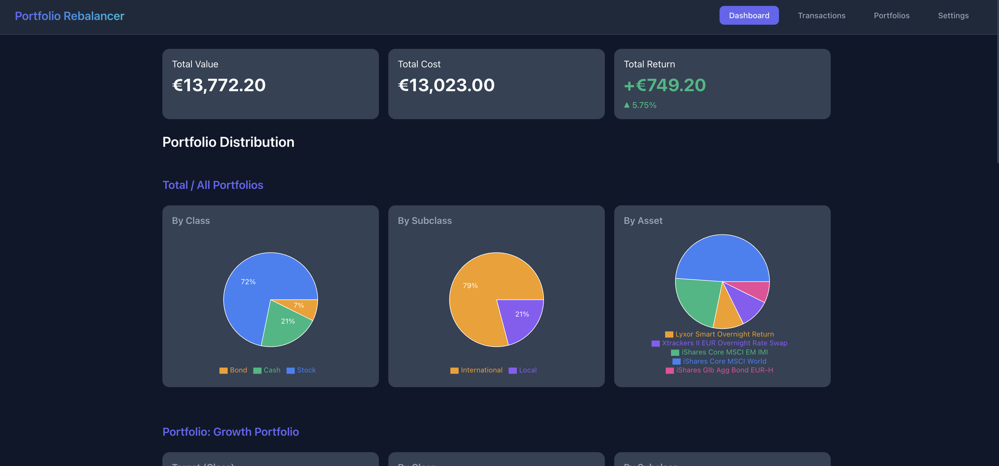
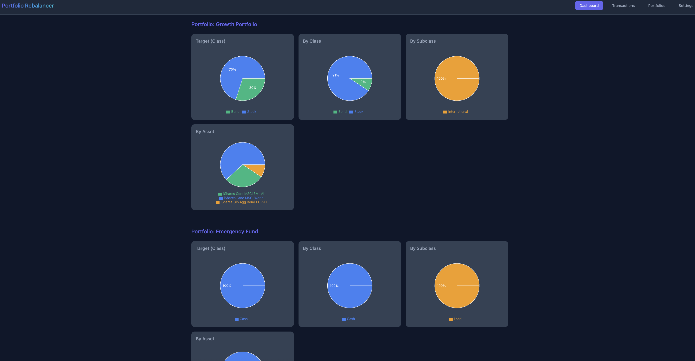
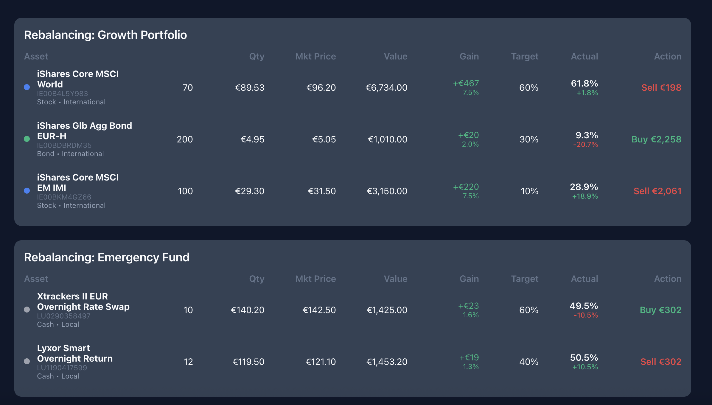
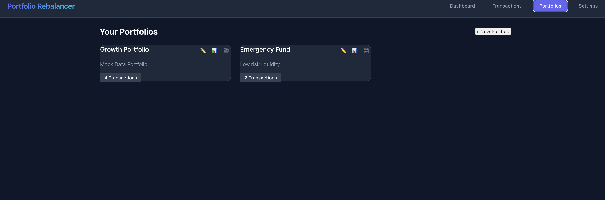
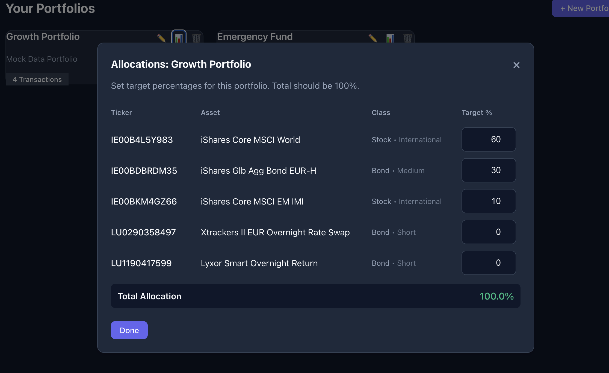

# Portfolio Rebalancer

This project is an **Agentic Development Experiment** created with **Antigravity** and **Gemini PRO**.

**Codex (GPT 5.2 Plus)** was employed as a control agent to analyze the codebase and provide architectural, compliance and security insights.

It was built in a **few hours** while multitasking, demonstrating the capabilities of agentic AI in handling end-to-end development, for a tool I actually needed for my own portfolio management.

Considering is a personal usage tool, there are many semplification. Like local storage only, online scraping and not usage of official quote API. But if you are ok with these you can also use the tool accepting that is provided as-is.

Tasks included:
- Architecture refactoring (Unified Frontend/Backend)
- Dockerization 
- Complex feature implementation (Multi-source scraping, Inline editing)
- UI/UX layout and design optimization

## Project Overview

Portfolio Rebalancer is a React+Express application designed to help investors track and rebalance their portfolios efficiently.

### Key Features
- **Smart Rebalancing**: Calculates exactly how much to buy/sell to meet target allocations.
- **Multi-Portfolio Support**: Create distinct portfolios (e.g., "Retirement", "Trading") and assigns transactions to them.
    - **Per-Portfolio Allocations**: Define specific asset allocation targets for each portfolio independently in the Settings.
    - **Portfolio Filtering**: Toggle the dashboard and transaction views to focus on a single portfolio or view the aggregate.
- **Transactions Management**:
    - **Bulk Updates**: Select multiple transactions to update properties (like Portfolio) in one go via a bulk edit toolbar.
    - **Excel Import**: Import transactions directly from `.xlsx` files.
    - **Inline Editing**: Quickly edit transaction details without leaving the list.
- **Asset Classification**: Hierarchical organization (Class -> Subclass) for better grouping and cleanup of unused assets (collapsed by default).
- **Multi-Source Price Scraping**:
    - **JustETF**: For standard ETFs.
    - **Borsa Italiana (MOT)**: Custom Puppeteer scraper for Italian BTPs/Bonds.
    - **CPRAM**: Custom Puppeteer for active funds
- **Unified Architecture**: Single Express server handling both API requests and serving the Vite frontend.
- **Custom Labels**: Assign custom display names to assets.

## Screenshots

### Dashboard
The central hub showing real-time asset allocation, total value, and actionable rebalancing recommendations. Now features an enhanced allocation table with detailed metrics per asset.
 

### Transactions
A detailed history of all trades with **Grouping by Portfolio**, bulk editing, and inline modifications. Use the bulk selection to easily move transactions between portfolios.

### Settings
Configuration page to manage:
- **Portfolio Targets**: Define target percentages for each asset class within each portfolio.
- **Unused Assets**: Manage or hide assets with 0% allocation.
- **Price Sources**: Configure scraping sources/URLs.
Includes **Developer Tools** to load mock data for testing.

#### Portfolio Management

#### Portfolio Targets

## Tech Stack
- **Frontend**: React 19, TypeScript, Vite, Recharts
- **Backend**: Node.js, Express, Docker
- **Scraping**: Puppeteer
- **Styles**: Vanilla CSS (Variables & Responsive Layout)

## Privacy Policy (Summary)

- **Data storage**: Portfolio data (transactions, targets, market data) is saved only in your browser's `localStorage` under the keys `portfolio_transactions`, `portfolio_targets_v2`, and `portfolio_market_data`. No portfolio data is sent to our server or to third parties.
- **Cookies**: The app does not set or read cookies for its own functionality. The backend Puppeteer script only dismisses third-party cookie banners (e.g., on Borsa Italiana) while scraping prices; it does not create cookies for users.
- **Device responsibility**: Because data lives in your browser, its protection depends on your device/browser security (login protections, screen lock, user profiles, antivirus). If a device or browser profile is shared, others may see the same saved data.
- **Removal of data**: You can erase all locally stored portfolio data from the **Settings** page using the existing "Clear all data" button; clearing your browser cache/localStorage or using private/incognito mode also removes it.
- **Data transmitted to APIs**: Price lookups send only the ISIN and selected source to the `/api/price` endpoint; no personal identifiers or portfolio balances are transmitted.

---
*Experiment conducted with Antigravity*
