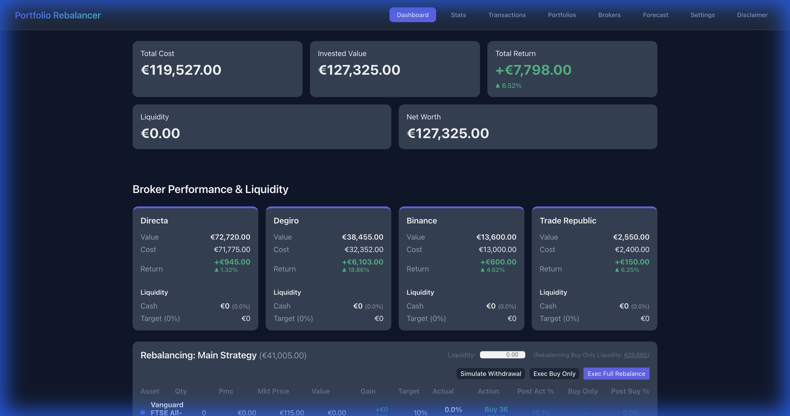
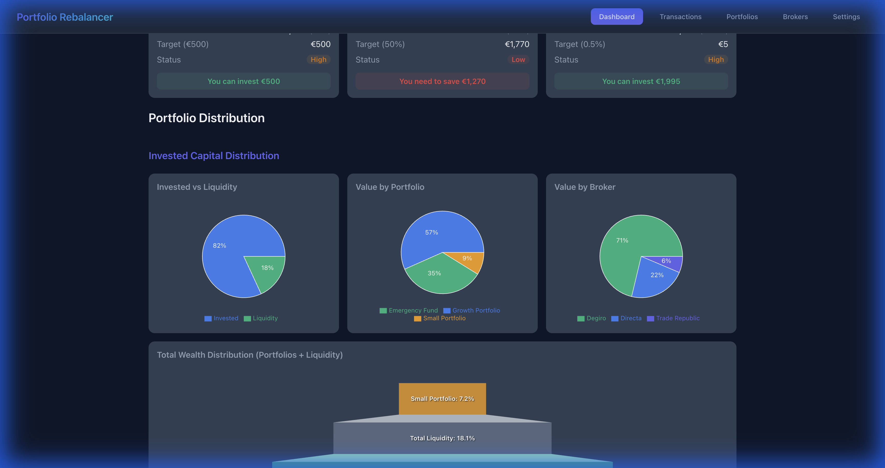
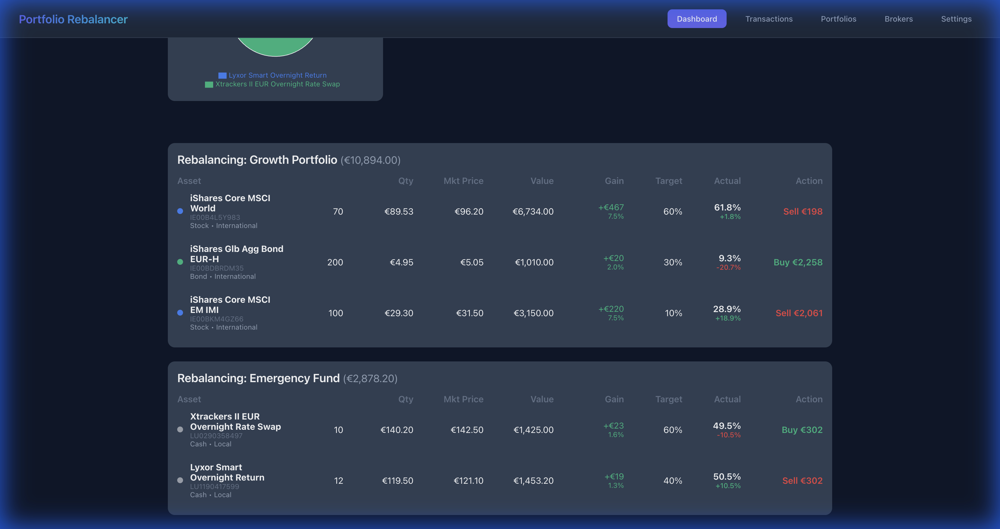
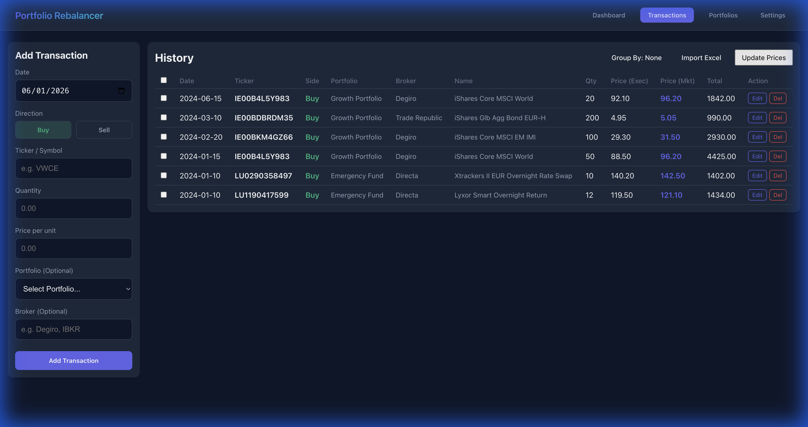
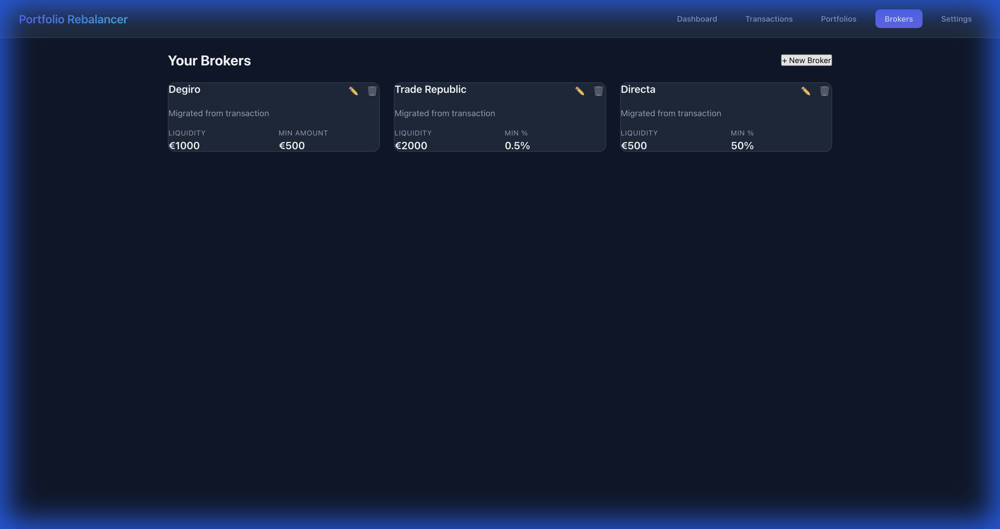
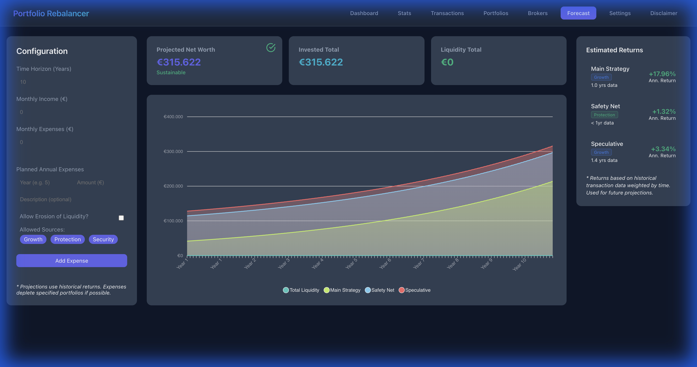
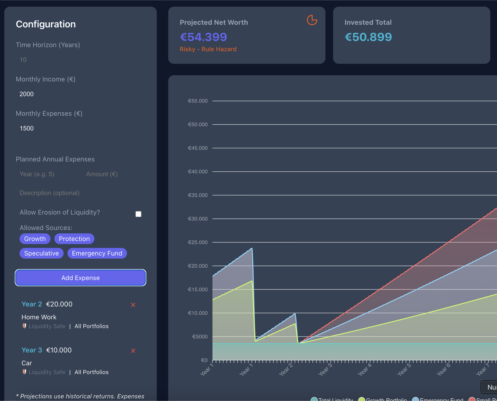
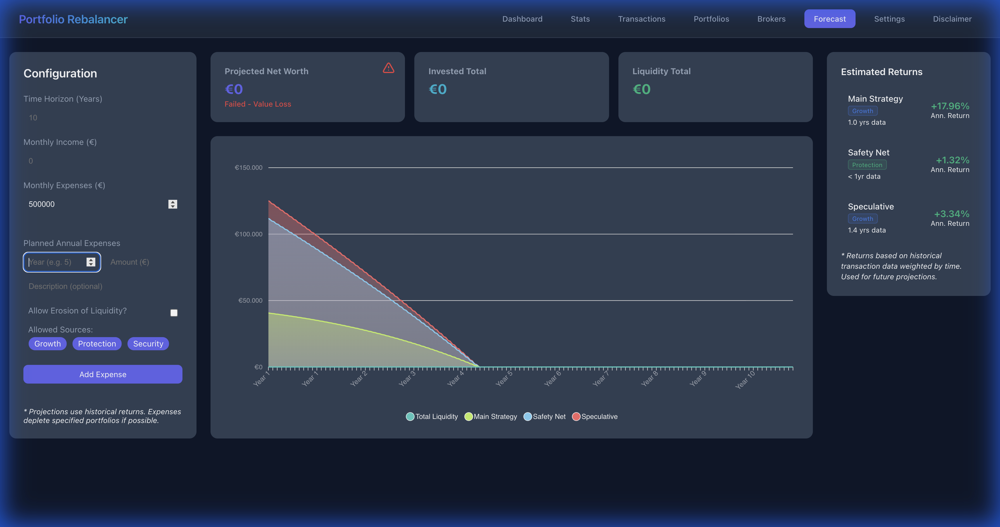
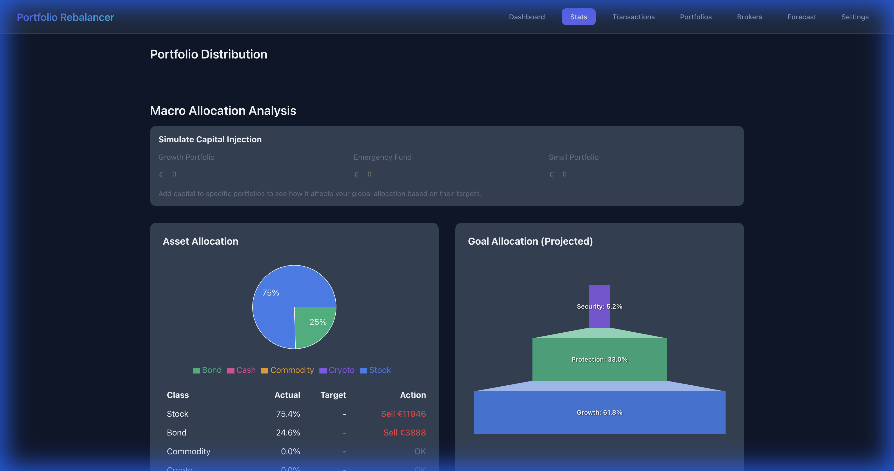
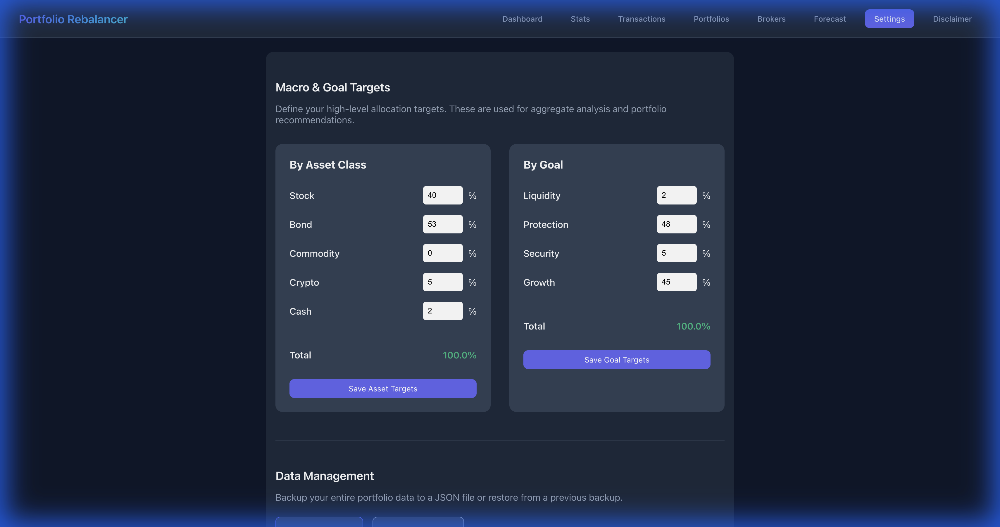

# Portfolio Rebalancer - Introduction

This project is an **Agentic Development Experiment** created with **Antigravity** and **Gemini PRO**.

**Codex (GPT 5.2 Plus)** was employed as a control agent to analyze the codebase and provide architectural, compliance and security insights.

It was built in a **few hours** while multitasking, demonstrating the capabilities of agentic AI in handling end-to-end development, for a tool I actually needed for my own portfolio management.
 
The goal was to create the tool I was looking for, replacing an overly complex Excel spreadsheet.

It also served as an opportunity to test agentic development in **"extreme mode"**: with the agent configured to "always proceed," I only handled high-level orchestration—specifying desired features and goals—while providing very limited architectural constraints and technical direction.

The AI was free to code from scratch, execute commands, write and run tests, write documentation, take screenshots automatically, and deploy. It was even capable of automatically analyzing websites to build custom scrapers.
The AI searched for external packages, investigated errors and issues on the web, and identified and implemented workarounds independently.

All this was impressive.

Since this is a tool for personal use, there are several simplifications, such as using local storage only, relying on web scraping instead of official quote APIs, and supporting only a single currency (EUR).

However, if you are comfortable with these limitations, you are welcome to use the tool as-is.

Tasks managed by the AI included:
- Architecture refactoring (Unified Frontend/Backend)
- Dockerization 
- Data Model Refactoring & Migration
- Automated Agentic Verification (Browser orchestration for E2E testing and documentation)
- Mock data generation and upgrade during data structure change
- Complex feature implementation (Multi-source scraping, Inline editing)
- UI/UX layout and design optimization, including chart generation and customization

## Project Overview

Portfolio Rebalancer is a React+Express application designed to help investors track and rebalance their portfolios efficiently.

### Key Features
- **Smart Rebalancing**: Calculates exactly how much to buy/sell to meet target allocations.
    -   **New Liquidity**: Option to inject fresh capital and simulate how it should be distributed.
    -   **Flexible Modes**: Choose between **Total Rebalancing** (Buy/Sell to perfect target) or **Buy Only** (allocate capital without selling existing positions).
- **Multi-Portfolio Support**: Create distinct portfolios (e.g., "Retirement", "Trading") and assigns transactions to them.
    - **Per-Portfolio Allocations**: Define specific asset allocation targets for each portfolio independently in the Settings.
    - **Portfolio Filtering**: Toggle the dashboard and transaction views to focus on a single portfolio or view the aggregate.
- **Transactions Management**:
    - **Bulk Updates**: Select multiple transactions to update properties (like Portfolio) in one go via a bulk edit toolbar.
    - **Excel Import**: Import transactions directly from `.xlsx` files (now supports "Broker" column).
    - **Inline Editing**: Quickly edit transaction details without leaving the list.
    - **Flexible Grouping**: Group transactions by Portfolio or Broker for easier analysis.
- **Broker Integration**:
    - **Performance Tracking**: Dedicated dashboard section for Value, Cost, and Return per Broker.
    - **Distribution Charts**: Visualize capital spread across different brokers.
- **Asset Classification**: Hierarchical organization (Class -> Subclass) for better grouping and cleanup of unused assets (collapsed by default).
- **Multi-Source Price Scraping**:
    - **JustETF**: For standard ETFs.
    - **Borsa Italiana (MOT)**: Custom Puppeteer scraper for Italian BTPs/Bonds.
    - **CPRAM**: Custom Puppeteer for active funds
- **Liquidity Management**:
    -   **Broker Tracking**: dedicated view to manage cash/liquidity per broker.
    -   **Thresholds**: Set minimum liquidity comparisons (%) to ensure cash buffers.
- **Financial Forecast**:
    - **Projection**: Estimate net worth and liquidity over a custom time horizon.
    - **Sustainability Checks**: Automatically flags plans as "OK", "Risky" (rule breach), or "Failed" (insolvency).
    - **Custom Expenses**: Add one-off annual expenses to refine the simulation.
- **Visual Enhancements**:
    -   **Centered Pyramid**: "Invested Capital Distribution" now uses a centered funnel/pyramid visualization for immediate clarity.
    -   **Premium UI**: Optimized spacing, hidden axes, and centered labels.
- **Unified Architecture**: Single Express server handling both API requests and serving the Vite frontend.
- **Custom Labels**: Assign custom display names to assets.
- **Data Management**:
    - **Backup & Restore**: Export your entire portfolio data to a JSON file and restore it at any time (Settings page).
    - **Safe Recovery**: Confirmation prompts to prevent accidental data overwrites during restore.

## Application Overview

### Dashboard
The main hub for your portfolio insights.

- **Financial Summary**: Total Value, Total Cost, and P&L.
- **Broker Performance**: Breakdown of value and return per broker.
- **Allocation Overview**: Asset distribution charts (Portfolio Size, Broker Share, Asset Class).
- **Rebalancing Tables**: Per-portfolio breakdown of assets with drift analysis.

### Transactions
Comprehensive history of all your investment activities.

- **Full History**: View all buys and sells.
- **Broker Tracking**: See which broker executed each trade.
- **Grouping**: Group transactions by Portfolio or Broker for easier analysis.
- **Bulk Edit**: Update multiple transactions at once (e.g., assign broker, move portfolio).

### Brokers
Manage your brokers and liquidity.

- **Liquidity Tracking**: Monitor available cash per broker.
- **Minimum Thresholds**: Set and track minimum liquidity requirements.

### Forecast
Project your financial future based on current assets, savings, and expenses.

- **Sustainability Analysis**: Checks if your plan survives your time horizon.
    - **OK**: All expenses covered, liquidity maintained.
    - **Risky**: Expenses covered, but rules (e.g., minimum liquidity) breached.
    
    - **Failed**: Insolvency reached before the end of the horizon.
    
- **Simulation**: Visualize net worth growth and liquidity usage over time.

### Statistics & Analysis
Deep dive into your portfolio's composition and macro-economic exposure.

- **Portfolio Pyramid**: Visual distribution of assets by risk/goal categories (Liquidity > Protection > Growth).
- **Macro Allocation**: Aggregate view of exposure to Stocks, Bonds, Crypto, etc. versus your defined targets.

### Portfolio Management
Organize your investments into distinct portfolios (e.g., "Retirement", "Risky Bets").

- **Isolation**: Each portfolio tracks its own contribution to your wealth.
- **Goals**: Set different strategies for different portfolios.

### Settings & Configuration
Manage target allocations, external data sources, and data safety.

- **Asset Definitions**: Define asset classes (Stock, Bond, etc.) for each ISIN.
- **Data Management**: Backup your entire database to JSON or restore from a previous backup.
- **Mock Data**: Quickly load sample data to test the application features.

## Tech Stack
- **Frontend**: React 19, TypeScript, Vite, Recharts
- **Backend**: Node.js, Express, Docker
- **Scraping**: Puppeteer
- **Styles**: Vanilla CSS (Variables & Responsive Layout)

## Privacy Policy (Summary)

- **Data storage**: Portfolio data (transactions including broker details, targets, market data) is saved only in your browser's `localStorage` under the keys `portfolio_transactions`, `portfolio_targets_v2`, and `portfolio_market_data`. No portfolio data is sent to our server or to third parties.
- **Cookies**: The app does not set or read cookies for its own functionality. The backend Puppeteer script only dismisses third-party cookie banners (e.g., on Borsa Italiana) while scraping prices; it does not create cookies for users.
- **Device responsibility**: Because data lives in your browser, its protection depends on your device/browser security (login protections, screen lock, user profiles, antivirus). If a device or browser profile is shared, others may see the same saved data.
- **Removal of data**: You can erase all locally stored portfolio data from the **Settings** page using the existing "Clear all data" button; clearing your browser cache/localStorage or using private/incognito mode also removes it.
- **Data transmitted to APIs**: Price lookups send only the ISIN and selected source to the `/api/price` endpoint; no personal identifiers or portfolio balances are transmitted.

---
*Experiment conducted with Antigravity*
