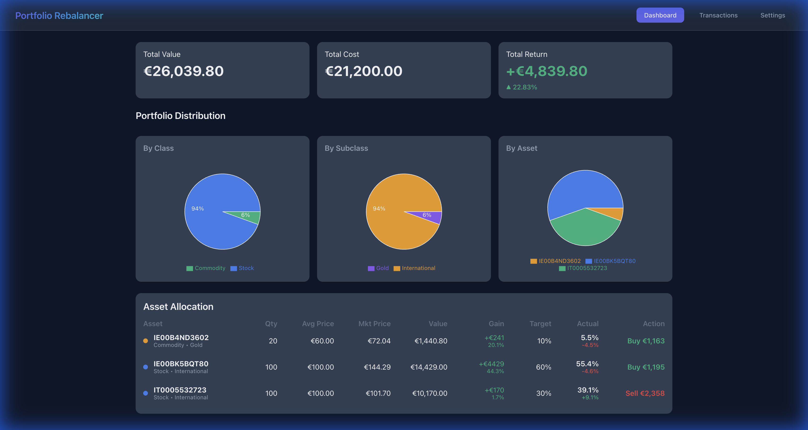
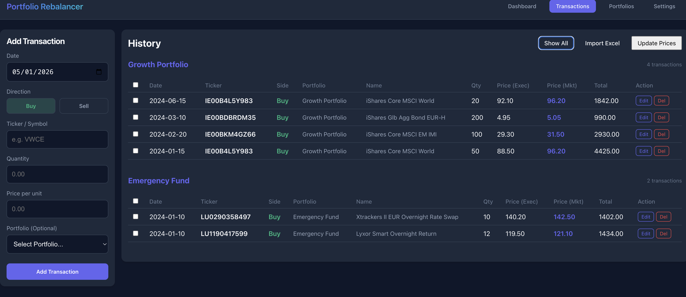
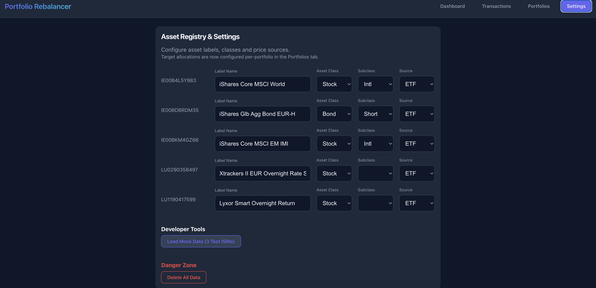

# Portfolio Rebalancer

This project is an **Agentic Development Experiment** created with **Antigravity** and **Gemini PRO**.

It was built in a **few hours** while multitasking, demonstrating the capabilities of agentic AI in handling end-to-end development, for a tool I actually needed for my own portfolio management.
Tasks included:
- Architecture refactoring (Unified Frontend/Backend)
- Complex feature implementation (Multi-source scraping, Inline editing)
- UI/UX layout and design optimization

## Project Overview

Portfolio Rebalancer is a React+Express application designed to help investors track and rebalance their portfolios efficiently.

### Key Features
- **Smart Rebalancing**: Calculates exactly how much to buy/sell to meet target allocations.
- **Multi-Source Price Scraping**:
    - **JustETF**: For standard ETFs.
    - **Borsa Italiana (MOT)**: Custom Puppeteer scraper for Italian BTPs/Bonds.
- **Asset Classification**: Hierarchical organization (Class -> Subclass) for better grouping.
- **Unified Architecture**: Single Express server handling both API requests and serving the Vite frontend.
- **Transactions Import**: Import transactions from Excel files (.xlsx).
- **Custom Labels**: Assign custom display names to assets (e.g. rename an ISIN to "S&P 500").
- **Asset Links**: Direct links to JustETF or Borsa Italiana MOT from the transaction history.

## Screenshots

### Dashboard
The central hub showing real-time asset allocation, total value, and actionable rebalancing recommendations.

### Transactions
A detailed history of all trades with inline editing capabilities and **Excel Import**.

### Settings
Configuration page to set target portfolio allocations, choose price sources for each asset, and **assign custom labels**.

## Tech Stack
- **Frontend**: React, TypeScript, Vite
- **Backend**: Node.js, Express
- **Scraping**: Puppeteer
- **Styles**: Vanilla CSS (Variables & Responsive Layout)

## Privacy Policy (Summary)

- **Data storage**: Portfolio data (transactions, targets, market data) is saved only in your browser's `localStorage` under the keys `portfolio_transactions`, `portfolio_targets_v2`, and `portfolio_market_data`. No portfolio data is sent to our server or to third parties.
- **Cookies**: The app does not set or read cookies for its own functionality. The backend Puppeteer script only dismisses third-party cookie banners (e.g., on Borsa Italiana) while scraping prices; it does not create cookies for users.
- **Device responsibility**: Because data lives in your browser, its protection depends on your device/browser security (login protections, screen lock, user profiles, antivirus). If a device or browser profile is shared, others may see the same saved data.
- **Removal of data**: You can erase all locally stored portfolio data from the **Settings** page using the existing "Clear all data" button; clearing your browser cache/localStorage or using private/incognito mode also removes it.
- **Data transmitted to APIs**: Price lookups send only the ISIN and selected source to the `/api/price` endpoint; no personal identifiers or portfolio balances are transmitted.

---
*Experiment conducted with Antigravity*
