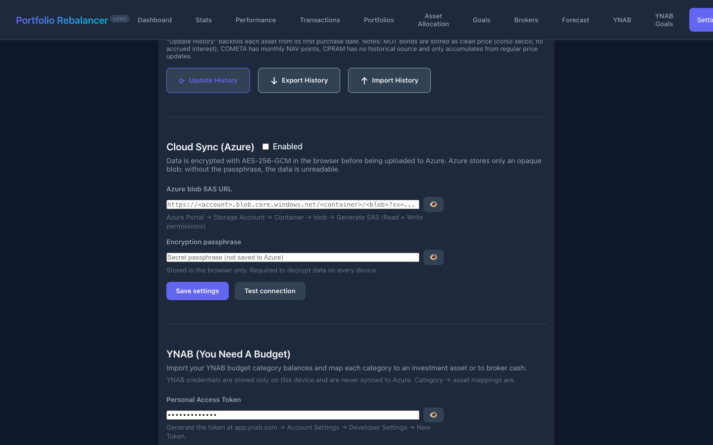

# Portfolio Rebalancer - Introduction

This project is an **Agentic Development Experiment** created with **Antigravity** and **Gemini PRO**.

**Codex (GPT 5.2 Plus)** was employed as a control agent to analyze the codebase and provide architectural, compliance and security insights.

**GPT 5.4 Plus and Claud Code Opus 4.6** was also used to implement some incremental feature and some rework

It was built in a **few hours** while multitasking, demonstrating the capabilities of agentic AI in handling end-to-end development, for a tool I actually needed for my own portfolio management.

The goal was to create the tool I was looking for, replacing an overly complex Excel spreadsheet.

It also served as an opportunity to test agentic development in **"extreme mode"**: with the agent configured to "always proceed," I only handled high-level orchestration—specifying desired features and goals—while providing very limited architectural constraints and technical direction.

The AI was free to code from scratch, execute commands, write and run tests, write documentation, take screenshots automatically, and deploy. It was even capable of automatically analyzing websites to build custom scrapers.
The AI searched for external packages, investigated errors and issues on the web, and identified and implemented workarounds independently.

All this was impressive.

Since this is a tool for personal use, there are several simplifications, such as using local storage only, relying on web scraping instead of official quote APIs, and supporting only a single currency (EUR).

However, if you are comfortable with these limitations, you are welcome to use the tool as-is.

Tasks managed by the AI included:
- Architecture refactoring (Unified Frontend/Backend)
- Dockerization
- GitHub Actions implementation
- Data Model Refactoring & Migration
- Automated Agentic Verification (Browser orchestration for E2E testing and documentation)
- Mock data generation and upgrade during data structure change
- Complex feature implementation (Multi-source scraping, Inline editing)
- UI/UX layout and design optimization, including chart generation and customization

## Project Overview

Portfolio Rebalancer is a React+Express application designed to help investors track and rebalance their portfolios efficiently.

### Key Features
- **Smart Rebalancing**:
    - **Per-Portfolio Drift**: each portfolio shows current vs target allocations with explicit buy/sell amounts to reach target.
    - **Global Asset Allocation**: a top-down view that splits total wealth across portfolios using fixed EUR amounts, percentages, locked balances, or ratio groups, and flags whether the overall configuration is sustainable.
    - **New Liquidity**: inject fresh capital and simulate how it should be distributed.
    - **Flexible Modes**: Total Rebalancing (buy/sell to target) or Buy Only (deploy capital without selling).
    - **Post-Action Preview**: projected allocation percentages after the suggested actions.
- **Goals & Pyramid View**: define ordered goals (Growth, Protection, Security, Liquidity, …) and assign portfolios to them for risk/horizon pyramid visualizations.
- **Multi-Portfolio Support**: distinct portfolios (e.g. "Main Strategy", "Tactical Tilt", "Bond Allocation", "Safety Net") each with its own target allocation, plus an aggregate view.
- **Transactions Management**:
    - Buys, sells, dividends, coupons, with per-row broker and portfolio.
    - **Bulk Updates**: select multiple transactions and update portfolio / broker / fees in one shot, with "keep original" labels for unchanged fields.
    - **Excel Import**: import `.xlsx` history from your broker (supports the "Broker" column).
    - **Inline & Modal Editing** for quick fixes vs full creation.
    - **Flexible Grouping**: group by Portfolio or Broker; group headers show running totals and **total fees** (toggleable EUR / %).
- **Broker Integration**:
    - Performance per broker (Value, Cost, Return).
    - Distribution chart of capital across brokers.
    - Liquidity tracking with minimum threshold per broker.
- **Asset Classification**:
    - Hierarchical Class → Subclass grouping.
    - Goal-based categories used in pyramid visualizations.
    - Support for unmanaged / legacy assets without transactions.
- **Multi-Source Price Scraping**:
    - JustETF for standard ETFs.
    - Borsa Italiana (MOT) Puppeteer scraper for Italian BTPs / bonds.
    - CPRAM Puppeteer scraper for active funds.
    - WebSocket-driven live progress modal during refreshes.
- **Financial Forecast**:
    - Net worth and liquidity projection over a configurable horizon.
    - Per-portfolio expected return breakdown (annualized).
    - Planned one-off and recurring expenses, with liquidity-erosion controls.
    - Sustainability verdict: **Sustainable / Risky / Failed**.
- **YNAB Integration**: pull your YNAB budget categories, see current vs **average budgeted allocation** over a configurable window, and map each category to an investment asset or broker cash.
- **Data Management**:
    - JSON backup / restore of all local data.
    - Optional encrypted Azure Blob sync (passphrase-derived key, only an opaque blob is uploaded).
    - One-click Mock Data load for safely exploring all features.
- **Disclaimer & Privacy**: dedicated page documenting local-only storage and non-commercial use.
- **Unified Architecture**: single Express server hosts the API and serves the built Vite frontend.

## Application Overview

All screenshots below are generated from the bundled mock dataset (Settings → "Load Mock Data") via `scripts/take_screenshots.js`.

### Dashboard
The main hub: financial summary, broker performance, allocation charts and per-portfolio rebalancing tables.


- **Financial Summary**: Total Cost, Invested Value, Net Worth, Price/Total Appreciation, Realized Gains and Distributions (dividends / coupons).
- **Broker Performance & Liquidity**: per-broker totals with return %.
- **Allocation Overview**: pie / donut charts (Portfolio share, Broker share, Asset Class).
- **Rebalancing Tables**: per-portfolio drift analysis with suggested actions.
- **Withdrawal Simulation**: plan divestments while preserving target allocations.


### Statistics & Analysis
Composition deep-dive across portfolios and macro exposure.


- **Portfolio Pyramid**: visual distribution by goal category (Growth, Protection, Security, Liquidity).
- **Macro Allocation**: aggregate exposure to Stocks, Bonds, Cash, etc. vs configured targets.
- **Per-portfolio breakdowns** with cost / value / return.

### Transactions
Full history of buys, sells, dividends, and coupons.


- **Group by Portfolio or Broker** with running totals and **total fees** in each group header (EUR / % toggle).
- **Inline add panel** on the left for quick entry.
- **Update Prices** button triggers the live scraping modal.

#### Bulk Edit


Select multiple rows to edit broker / portfolio / fees together. Unchanged fields display a "keep original" label so you know exactly what will change.

#### Excel Import


Import an `.xlsx` history file from your broker — the importer recognises a `Broker` column and maps it onto each transaction.

### Portfolios
Organize investments into distinct portfolios (e.g. "Main Strategy", "Safety Net", "Bond Allocation").


- Each portfolio tracks its own contribution to total wealth.
- Per-portfolio asset allocation targets, edited directly from the portfolio card.

### Asset Allocation (Global Rebalancing)
Top-down split of total wealth across portfolios.


- Set each portfolio's target as **Fixed EUR**, **% of total**, **Locked** (excluded from rebalancing), or part of a **Ratio Group** that splits a remainder pool by configurable weights.
- Dedicated **Liquidity Target** (broker cash) row.
- Sustainability indicator and per-portfolio delta vs current value, with suggested buy / sell actions.

### Goals
Order assets by purpose — Growth, Protection, Security, etc. — and attach portfolios to each goal for the pyramid visualizations on the Stats and Dashboard pages.


### Brokers
Manage brokers and their cash positions.


- **Liquidity Tracking**: monitor available cash per broker.
- **Minimum Thresholds**: set and track minimum liquidity requirements.

### Forecast
Project net worth and liquidity over a configurable horizon.


- **Annualized expected return** per portfolio, with goal category.
- **Planned annual expenses** with sources (Growth / Protection / Security) and an optional "allow erosion of liquidity" toggle.
- Sustainability verdict updates live with inputs:
    - **Risky** — expenses covered but liquidity thresholds breached.
    - 
    - **Failed** — insolvency reached before the end of the horizon.
    - 

### YNAB Import
Pull YNAB categories and map them to assets or broker cash.


- **Current** vs **Avg N-month** budgeted columns (configurable window).
- Per-category mapping to investment asset or broker cash.
- Search / filter; summary by mapped asset; "Sync now" button.
- Credentials and mappings stay local to the device.

### Settings
Manage data, sync, mock data and external integrations.





- **Data Management**: backup to JSON, restore from JSON.
- **Cloud Sync (Azure)**: optional encrypted blob sync with passphrase-derived key.
- **YNAB**: personal access token and budget selection.
- **Asset & Allocation Definitions**: classes, subclasses, custom labels, targets.
- **Developer Tools**: Load Mock Data (with safety confirm) and clear-all.


### Live Price Updates
Real-time feedback during multi-source scraping, powered by WebSockets.


- Per-ISIN progress, success and error states.
- Errors on individual assets do not abort the whole batch.

### Disclaimer


- **Privacy Info**: details on local storage and data usage (localStorage).
- **Terms**: non-commercial use disclaimer.
- **Mock Data Ref**: information on test data generation.

## Tech Stack
- **Frontend**: React 19, TypeScript, Vite, Recharts, ApexCharts, SweetAlert2
- **Backend**: Node.js, Express, Socket.IO, Docker
- **Scraping**: Puppeteer (Borsa Italiana, CPRAM), Cheerio (JustETF)
- **Storage**: browser `localStorage`, optional encrypted Azure Blob sync
- **Styles**: Vanilla CSS (variables, responsive layout)

## Regenerating the Screenshots

The screenshots above are produced by `scripts/take_screenshots.js`, which uses Puppeteer to walk every page against a running server:

```bash
npm run dev               # starts the unified Express + Vite server on :3002
node scripts/take_screenshots.js
```

The script loads mock data through the Settings UI, navigates each nav entry, opens key modals, and writes PNGs to `screenshots/`.

## Privacy Policy (Summary)

- **Data storage**: Portfolio data (transactions including broker details, targets, market data) is saved only in your browser's `localStorage` under keys such as `portfolio_transactions`, `portfolio_targets_v2`, `portfolio_market_data`, `portfolio_goals`, and `portfolio_ynab_*`. No portfolio data is sent to our server or to third parties.
- **Optional cloud sync**: if you enable Azure Blob sync, only an opaque ciphertext blob (encrypted with a passphrase you choose) is uploaded; the passphrase is never transmitted.
- **Cookies**: the app does not set or read cookies for its own functionality. The backend Puppeteer scripts only dismiss third-party cookie banners (e.g. Borsa Italiana) while scraping prices; they do not create cookies for users.
- **Device responsibility**: because data lives in your browser, its protection depends on your device/browser security (login protections, screen lock, user profiles, antivirus).
- **Removal of data**: erase all locally stored portfolio data from the **Settings** page using the existing "Clear all data" button; clearing your browser cache/localStorage or using private/incognito mode also removes it.
- **Data transmitted to APIs**: price lookups send only the ISIN and selected source to the `/api/price` endpoint; no personal identifiers or portfolio balances are transmitted. YNAB calls go directly from your browser to YNAB using your personal access token.

---
*Experiment conducted with Antigravity*
