# Portfolio Rebalancer

A self-hosted web app to **track, analyse and rebalance an investment portfolio** of ETFs and bonds — built to replace an over-complicated personal spreadsheet.

It answers the questions a buy-and-hold investor actually asks: *How is my net worth doing? Am I off my target allocation, and exactly what should I buy or sell to get back on track? Can I afford this planned expense over the next N years? Where is my cash sitting?*

Everything runs locally: a single Express server serves the API and the built React frontend, and all your data lives in your browser. Prices are refreshed on demand from public Italian/European market sources.

**It is free and non-commercial.** This is a personal utility tool, built and shared **free of charge** for personal, non-commercial use. Nothing here is sold, no plan is paid, there is no subscription, no account and no telemetry — the *public* and *private* tiers below are only a load-management setting on the shared price scraper, not a price list.

---

## What it is — and what it is *not* (constraints)

This is a **free, non-commercial personal utility tool with deliberate simplifications**. Read these before using it:

| Constraint | Detail |
|---|---|
| **Single currency** | Everything is reported in **EUR**. Foreign-currency quotes are converted to euro on the way in (see below); there is no multi-currency reporting. |
| **Local-first storage** | All portfolio data lives in your browser's `localStorage`. There is **no account, no server-side database**. Clearing the browser, switching device or using incognito loses the data unless you back it up. |
| **Backups are your job** | Export a JSON backup yourself, or enable the optional encrypted Azure Blob sync. Price history has its own separate backup. |
| **Prices via scraping, not official APIs** | Quotes come from a small set of fixed public sources, not a licensed market-data feed: **JustETF** (standard ETFs), **Borsa Italiana / MOT** (Italian BTPs & bonds), **CPRAM** (some active funds), **COMETA** and **ALIFOND** (the pension funds' own NAV pages), and **FT Markets** (anything the others don't list, e.g. Luxembourg-domiciled funds). No other tickers are supported out of the box. Quotes that come back in another currency (USD is common on FT Markets) are converted to EUR server-side using **xe.com** — the spot rate for live prices, the rate of each day for historical series — so the app only ever handles euro amounts. |
| **Public vs private price tier** | Without a private-tier key, *Update Price* runs on a **throttled public tier** (server-wide concurrency cap, prices cached up to ~24h). A private-tier key unlocks unlimited, real-time updates. Neither tier is sold: the key simply reserves the scraper for the instance owner. |
| **Asset universe** | Designed around **ETFs and bonds**. No crypto, options or derivatives modelling. |
| **Not financial advice** | Returns, forecasts and rebalancing suggestions are mechanical calculations on your own inputs. They are not advice. |

If you are comfortable with the above, you are welcome to use it as-is.

---

## Running it

```bash
npm install
npm run build      # builds the Vite frontend into dist/
npm start          # Express serves API + frontend on http://localhost:3002
```

Then open the app and go to **Settings → Load Mock Data** to populate a full demo dataset that exercises every feature (this is also exactly what the screenshots below show).

**Tech stack:** React 19 + TypeScript + Vite, Recharts & ApexCharts, SweetAlert2 · Node.js + Express + Socket.IO · Puppeteer + Cheerio for scraping · `localStorage` with optional AES-256-GCM Azure Blob sync · Docker + GitHub Actions.

> All screenshots below are generated from the bundled mock dataset via `scripts/take_screenshots.js`.

---

## The app, page by page

### Dashboard

The home hub: the financial summary, broker performance, allocation charts and per-portfolio rebalancing tables.

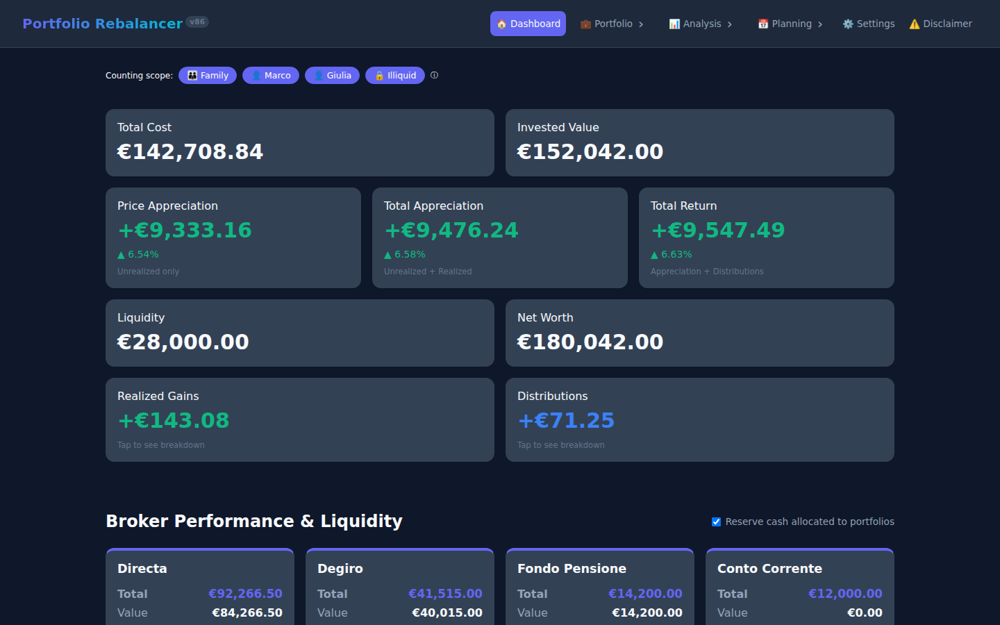

**Financial summary cards** give the whole picture at a glance:

- **Total Cost** / **Invested Value** — what you paid vs what the holdings are worth now.
- **Price Appreciation** (unrealized only), **Total Appreciation** (unrealized + realized) and **Total Return** (appreciation + distributions), each with its percentage.
- **Liquidity** and **Net Worth** (holdings + cash).
- **Realized Gains** and **Distributions** (dividends / coupons) — tap either to see the breakdown.

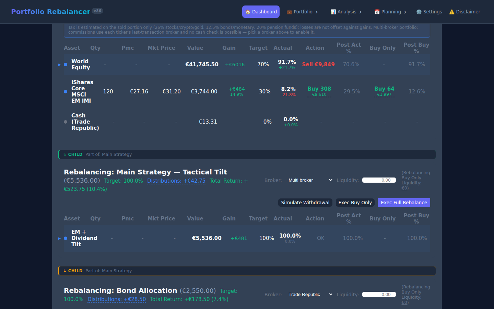

- **Broker Performance & Liquidity** — per-broker Total / Value / Cost / Return, plus available cash.
- **Allocation Overview** — donut charts for portfolio share, broker share and asset class.

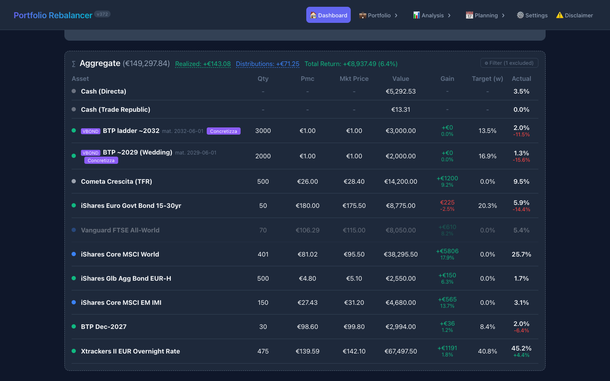

- **Per-portfolio rebalancing tables** — current vs target allocation with the explicit buy/sell amount needed to reach target, plus a **Buy Only** column that deploys new capital toward the target without selling (recurring savings plans live in [PAC](#pac), under Planning).
- **Single / Merged / Group** — a portfolio with sub-portfolios gets a three-way switch. *Single* is one table per member; *Group* is the comparison matrix, one column per member; **Merged** folds the whole group into a single table, as if parent and children were one portfolio. Each member's targets are normalized and scaled by its share of the group (taken from the [Asset Allocation](#asset-allocation-global-rebalancing) parent/child ratio, e.g. *Core 80% / Bond Buffer 20%*), so as long as parent and children hold different assets one merged rebalance closes both things at once: each member's own internal allocation *and* the ratio between them. Orders are booked against whichever member actually holds the asset, and the confirm dialog shows the split before anything is written.
- **∑ Aggregate** — every holding across every portfolio in one table: value, gain, actual weight and the value-weighted target the per-portfolio allocations add up to. It is a **readout, not a rebalancer** — a global order would have to be split across portfolios that answer to different goals, so acting happens in the per-portfolio tables above and, at goal level, in [Fund Relocation](#fund-relocation).
- **Sell friction** — a full rebalance sizes its buys on the *net* proceeds of the sales it proposes: the sale commissions come out first, so the plan stays payable. Each table's **Broker** selector picks the portfolio's *broker di appoggio*: with one selected, every leg is priced against that broker's commission plan and checked against its available cash; left on *Multi broker* (for a portfolio spread across several) the per-ticker heuristic applies and no cash check is made.

**Trade cost popover** — every Action / Buy Only cell reveals, on hover or tap, what that trade would actually cost: the implicit **bid/ask spread cost** plus the **simulated commission for every broker** (from each broker's commission plan), a **free-buy promo toggle** that waives the buy fee, and a **break-even holding time** — how long the asset's own historical return needs to offset a full buy→sell round trip including taxes. This makes two interchangeable instruments comparable: e.g. a commission-bearing ETF vs a commission-free one with a wider spread.

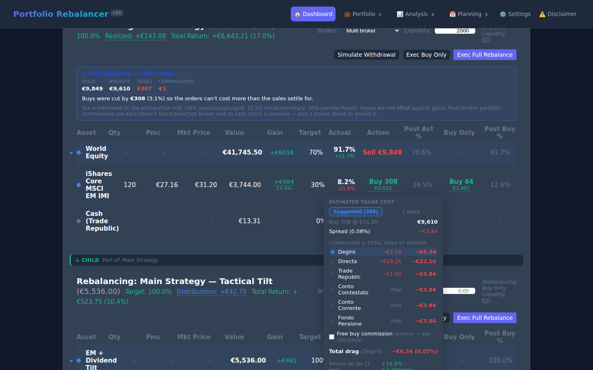

**Withdrawal Simulation** lets you plan a divestment while keeping the portfolio close to its target weights: enter the **net cash you need** and it works backwards to the gross amount to sell, netting out capital-gains tax (26% stocks / 12.5% bonds, on the gain portion only) and the sell commissions of each asset's broker, then lists the per-asset sell actions and the resulting post-sale weights.

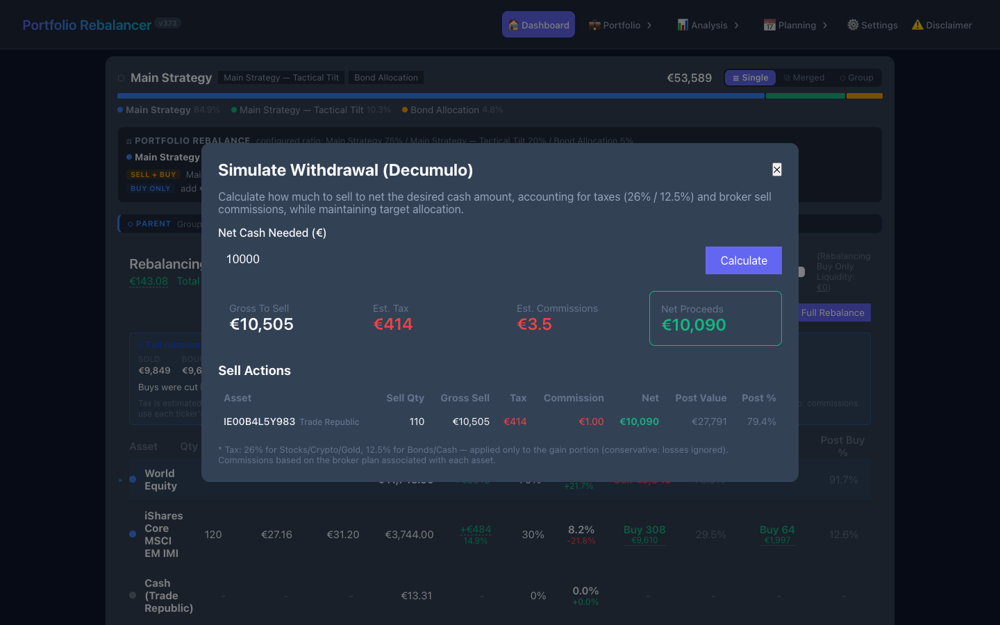

### Stats

A composition deep-dive across portfolios and macro exposure.

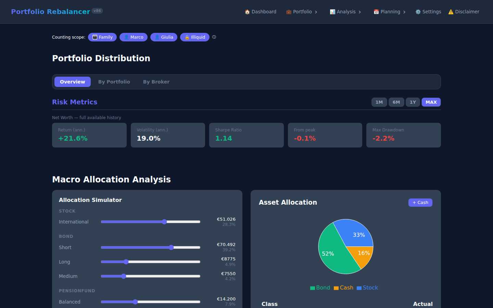
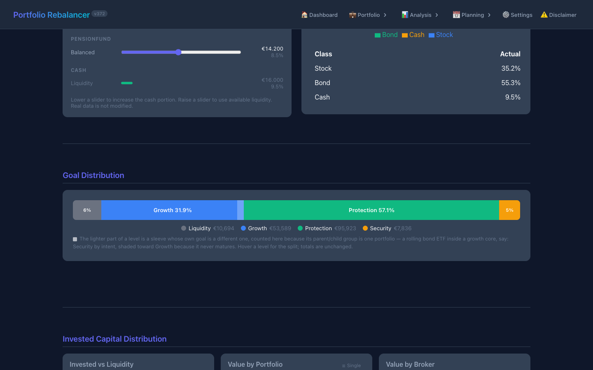
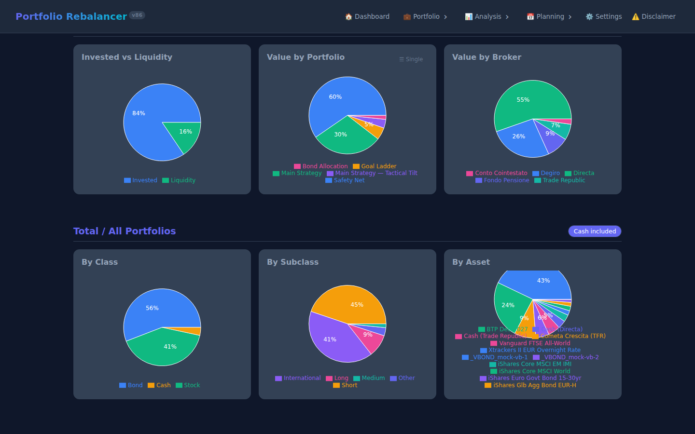

- **Portfolio Pyramid** — wealth distribution by goal category (Growth → Protection → Security → Liquidity).
  - Parent/child groups count as **one portfolio**, so a sleeve carrying a *different* goal than its parent — the usual case for, say, a rolling bond ETF inside a growth core — is counted at the parent's level and drawn as a **lighter shade of that level's colour**, with its own goal named on hover. That is a re-bucketing, never a re-count: the pyramid's total is identical either way, and `nativeValue + Σ inherited === value` at every level. A portfolio with no goal at all stays outside the pyramid, group member or not — exactly as before.

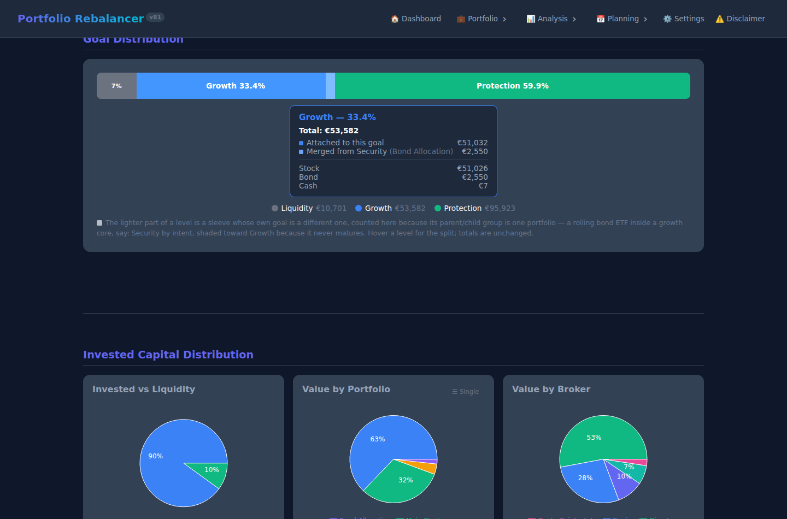
- **Macro Allocation** — aggregate exposure (Stocks, Bonds, Cash…) vs your configured targets.
- **Per-portfolio breakdowns** with cost / value / return.
- **Group breakdowns** — where a portfolio has sub-portfolios (see *Parent Portfolio* in the portfolio form), the *By Portfolio* tab shows the parent and its children aggregated into a single set of charts first — one composition bar for the members' weights, group-level risk metrics, and a target blended by member value — then each portfolio again on its own. The Overview's *Value by Portfolio* pie has a **Single / Grouped** switch that folds children into their parent's slice. The rebalancing tables have their own **Single / Merged / Group** switch — see [Dashboard](#dashboard).

### Fund Relocation

A what-if for moving money between buckets, with the friction included.

Portfolios here are logical containers over transactions, so relocating funds is not a bookkeeping edit: it is **sell there, buy here**, and the round trip permanently leaks capital-gains tax and two sets of commissions. Every other view would show the money simply arriving; this one shows what it costs to get there.

Either end can be a **whole parent/child group** as well as a single portfolio — both are listed in the pickers. A group instruction is expanded into real per-member moves *before* it is queued, so the queue, the what-if and the ledger only ever hold portfolios that exist. The split is not arbitrary: money leaving is taken from whichever member is heaviest against the group ratio and money arriving goes to whichever is lightest, so moving between goals quietly closes the parent/child ratio instead of dragging it further off. Picking a group and one of its own members as the two ends is refused — it is the same money.

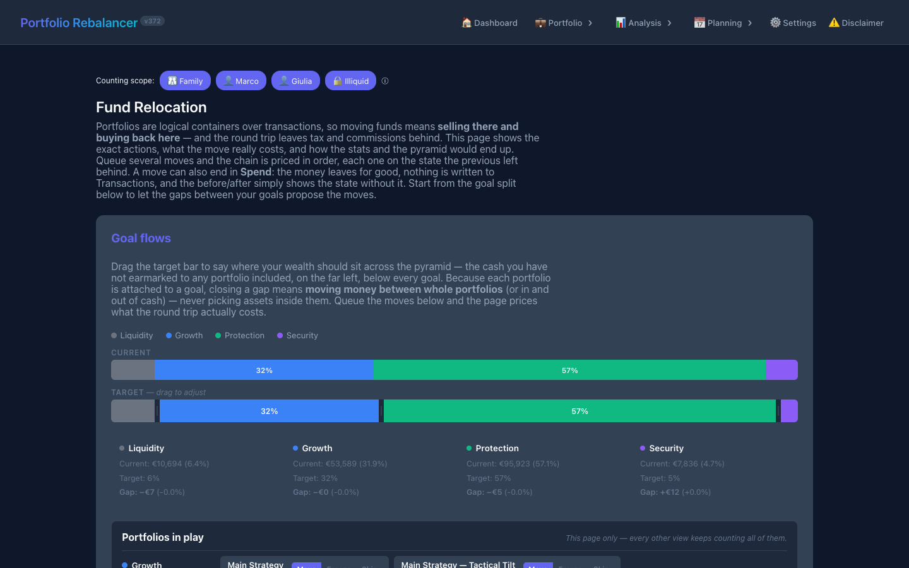

- **Goal flows — the editable pyramid.** Drag the target bar to say where your wealth should sit across the goals; because each portfolio is attached to a goal, the answer is a list of **moves between whole portfolios** (out of the portfolios of the goals over target, into those of the goals under it), never a pick of assets inside them. Donors and receivers are matched largest-first so the plan uses as few round trips as possible, each goal is drained proportionally to what its portfolios hold, and any leg too small to be worth its friction is dropped and reported. A **parent/child group counts as one portfolio** for that split — the same unit the pyramid counts it as — and the amount landing on it is then shared across its members by the **configured parent/child ratio**, taken from whoever is heaviest against it and given to whoever is lightest, so closing a goal gap also closes the group's ratio instead of handing it its money in the proportion it is already wrong in. *Queue* hands the moves to the sequence below, where they get priced like any other — and the before/after pyramid at the bottom shows whether the split you dragged is worth what it costs to reach.
- **Source and destination are the same kind of thing** — either a **portfolio** or **cash**. That one switch covers a divestment (portfolio → cash), an investment (cash → portfolio, so no sale and no tax) and the full round trip (portfolio → portfolio).
- **Spend — money that simply stops being there.** The destination has a third option the source cannot have: *Spend*. Part of the cash is treated as **spent**, so it is no longer part of anything — net worth, liquidity, the macro split and the goal pyramid are all read without it. It is **never written to Transactions**: the ledger records positions, and a holiday or a new kitchen is not a position. That is the whole point of the endpoint — it exists to answer *what do my stats look like once this money is gone*, not to book it. Spend straight out of cash and nothing is sold and nothing is charged; spend more than the cash on hand and the same overdraft and minimum-liquidity warnings apply as anywhere else. Fund it out of a **portfolio** instead and the sale is priced in full (tax and fee included) and sized backwards from the amount you want to spend — the amount is exact, so the change whole shares leave behind stays in the account instead of being spent by accident, and it is reported. Net worth then falls by the spend **plus** the friction, and the before/after line names the two apart: friction is money paid to someone else, a spend is money you chose to use.
- **The exact asset is optional on each side, independently.** Pin nothing and the solver picks: it sells whatever is most overweight against the source's targets — so a relocation leaves the source *closer* to its allocation, not skewed — and buys the destination's most underweight units, routing an allocation group's order to the same member the Dashboard's *Buy Only* column would. Pin one side to sell (or buy) only that ticker; pin both for a straight X → Y swap.
- **The amount is what must land, not what leaves.** Enter the net you want working in the destination and the sales are sized backwards from it, including a second pass so the sale also covers the *buy* commission. Whole-share rounding means the plan can only overshoot, never under-deliver silently; when the source genuinely cannot raise the amount, it says so with the shortfall in euro.
- **Sell and buy tables** list every leg: shares, price, PMC, gross, the taxable portion, the rate applied (26% / 12.5% / 20% by asset class), commissions and the net. Tax hits only the sold portion — shares × (price − PMC) — and a leg sold at a loss is taxed 0 without offsetting the other legs' gains, since netting would need the *zainetto fiscale* the app does not model.
- **Transfer between brokers — an action, not a transaction.** Cash is held per broker, so a sale at Degiro cannot pay for a purchase at Directa: the plan lists the **wire** to make, from which broker to which and for how much, between the sells and the buys where it actually happens. It is flagged amber when the buying broker would otherwise go short (the buys cannot clear until the money arrives) and left neutral when it can pay from its own cash — then the wire only puts the proceeds back where they belong. Nothing is ever written to the ledger for it: no position changes and no gain is realised, so it stays out of the transactions and only moves the projected broker balances.
- **Warnings, not silent assumptions** — cash left undeployed by whole-share rounding, a wire the buys cannot clear without, and, for a cash source, the same three floors the rebalancer respects: overdraft, cash earmarked for other portfolios, and the broker's minimum liquidity.
- **Before / after** for net worth, invested, liquidity, cost basis, and the realized/unrealized split — a sale converts unrealized gain into realized, and taxed. Net worth falls by *exactly* the friction — plus whatever a *Spend* destination took out of it.
- **Chain several moves and see where you land.** *Add this move to the sequence* queues it and the form starts a new move **on top of the previous state** — the dropdowns offer the positions the earlier moves created, and the plan spends the cash they raised. This is not several independent what-ifs side by side: selling in step 3 what step 1 bought pays the commission twice and is taxed on the average cost step 1 produced, so a chain costs strictly more than its parts priced in isolation. Each step lists its own actions and friction when expanded, can be reordered or removed (the whole chain is re-priced), and the comparison at the bottom of the page always measures **today against the end of the sequence** — including the move still being edited.

- **Actions to perform, then "Mark as executed".** The queue is flattened into the steps you actually take, numbered across the whole chain and in the only order the money can travel in: *sell here → wire there → buy at the other end*. Confirming records the **sells and buys as transactions** and settles the broker balances the way the plan priced them — a sale credits its broker **net of the capital-gains tax and the fee**, each wire debits one broker and credits the other, a purchase debits what it costs including its fee. The wire is the one step that never reaches the ledger: nothing is bought, sold or earned by it. A move ending in a **spend** is listed but marked *simulated* and skipped whole — neither the spend nor the sale that would fund it is recorded, since committing half of it would leave the ledger disagreeing with the very what-if the move was made for. Liquidity is kept in the background from the plan's own figures, so re-align it by hand afterwards if your statement disagrees.

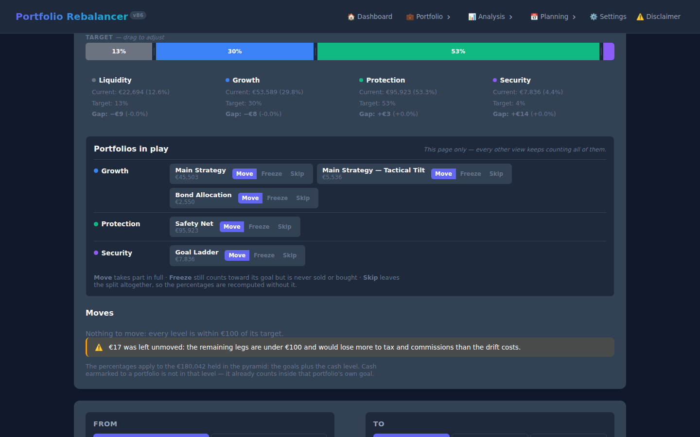

- **The Stats charts, drawn twice** — Asset Allocation, Invested vs Liquidity, Value by Portfolio and Value by Broker, each as it is now and as the plan would leave it, with the euro delta per slice under the pair. A category keeps its colour across the two pies, so a portfolio that changes rank is still easy to follow. The page counts what the Stats page counts: the family/illiquid/person scope chips apply here too.


- **Macro allocation and the goal pyramid, side by side.** Both are measured with the same calculators the Stats page uses, so the "before" column is that page's own arithmetic rather than a second opinion — and the pyramid total, which is net worth, visibly shrinks by the tax and commissions.

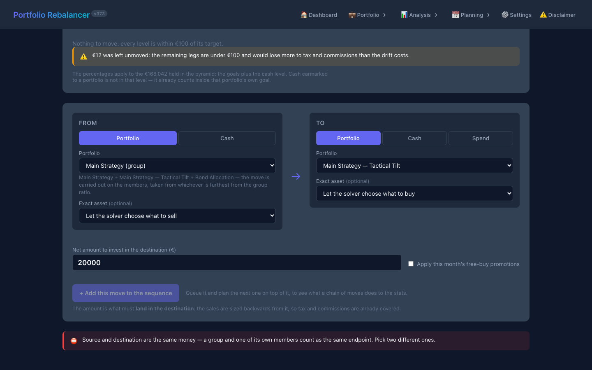

### Performance

Historical net-worth and price charts, powered by the **daily price history** the app accumulates (see *Settings → Price History*).

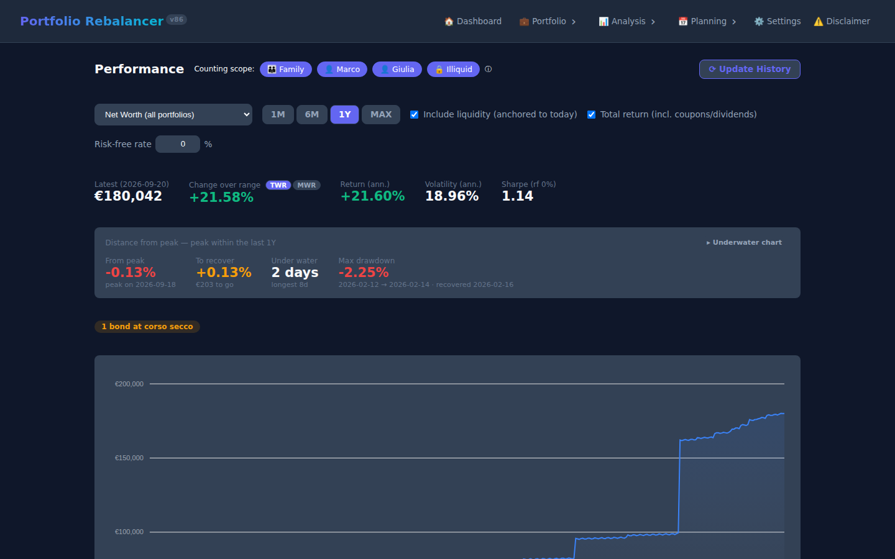

- **Scope selector** — chart your whole **Net Worth**, a **parent/child group** as one portfolio, a single **portfolio**, or a single **asset**. Groups and their members are both listed, and the selector is single-choice, so a group is never charted on top of its own members.
- **Ranges** — 1M / 6M / 1Y / MAX.
- **Net worth** can optionally overlay today's liquidity as a constant line.
- **Return toggle** — switch between **TWR** (Time-Weighted Return, strips out deposits/withdrawals) and **MWR** (Money-Weighted Return, which on MAX matches the Dashboard's Total Appreciation).
- **Risk metrics** — flow-adjusted **annualised return**, **annualised volatility**, **Sharpe ratio** (with a configurable risk-free rate) and **max drawdown**, all computed on the return stream net of deposits/withdrawals so a withdrawal never counts as a "loss". A **liquidity overlay** tracks uninvested sale proceeds, so the chart doesn't show fake crashes when you sell.
- **Distance from peak** — a dedicated row measuring the scope against its **high-water mark** instead of against the invested capital: how far below the peak it sits **right now**, the gain (**% and €, at today's capital**) still needed to get back, the **days under water** (and the longest such stretch), and the **max drawdown** with its peak → trough → recovery dates. Built on the same flow-adjusted index as the other risk metrics, so new money paid in never sets a fake peak and a disinvestment never digs a fake drawdown. A toggle opens the **underwater chart**, the whole curve of distance-from-peak over time.
- **Caveat badges** flag where history isn't directly comparable — e.g. bonds held at *corso secco* (clean price, no accrued interest), monthly-NAV sources, or assets with no history yet.


Distance from the high-water mark, with the underwater curve open:

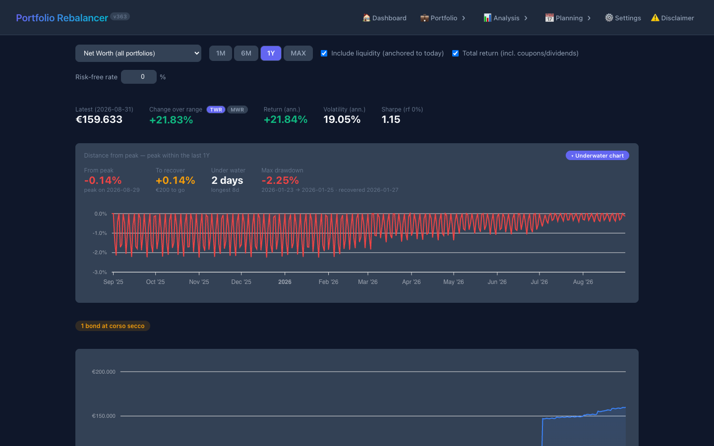

Per-asset view, here a long-duration govt bond priced at *corso secco*:

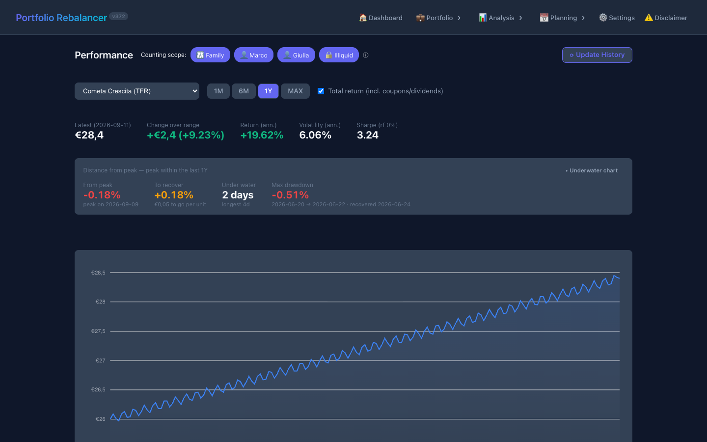

### Summary

A rolling-year read of your YNAB spending, turned into a plain-language cash-flow narrative and a set of deterministic suggestions.

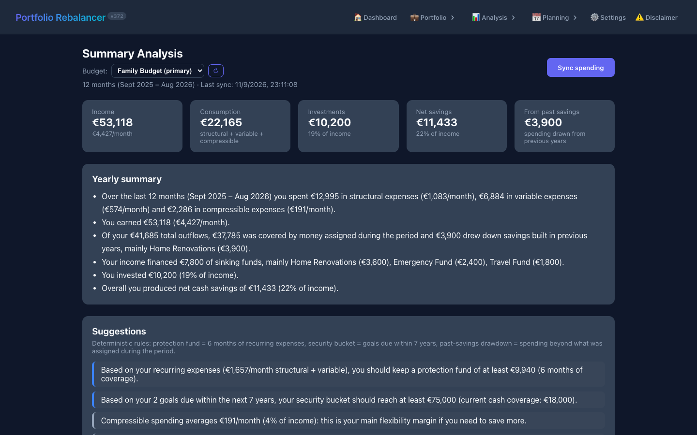

- **Cards** — income, consumption (structural + variable + compressible), investments, net savings and how much of the year's spending was drawn from **savings built in previous years** rather than from money assigned during the period.
- **Yearly summary** — the same figures written out as sentences, including which sinking funds your income financed and what was covered by past savings.
- **Suggestions** — rule-based, not predictive: protection fund = 6 months of recurring expenses, security bucket = goals due within 7 years, a warning ahead of each planned expense, and a flag for any category still unmapped.

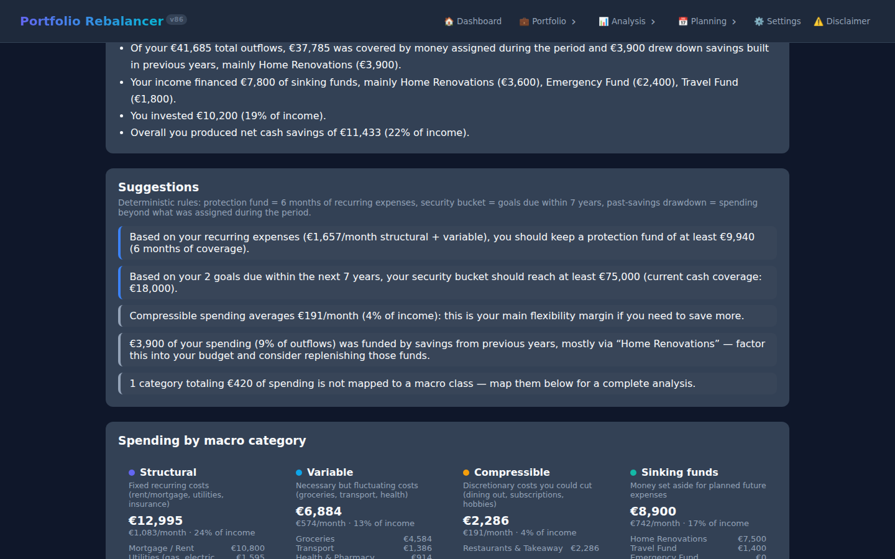

- **Spending by macro category** — the year's outflows split into structural, variable, compressible, sinking funds and investments, each with its monthly average, its share of income and its top categories.
- **Budget selector** — each YNAB budget keeps its own rolling-year history, so a family budget and a personal one are analysed separately.

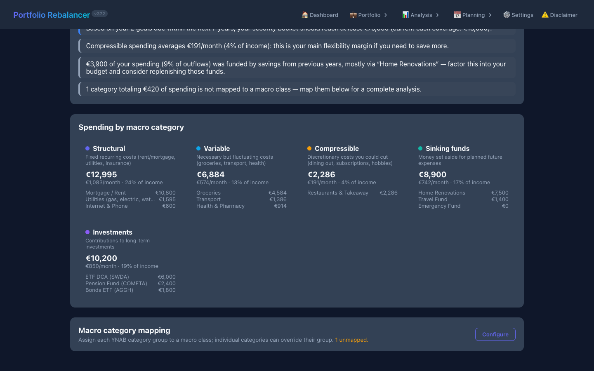

- **Macro mapping** — every YNAB category group is assigned a macro class, and individual categories can override their group (here *Restaurants & Takeaway* is compressible while the rest of *Monthly Expenses* is variable). Unmapped groups are called out so nothing silently drops out of the totals.

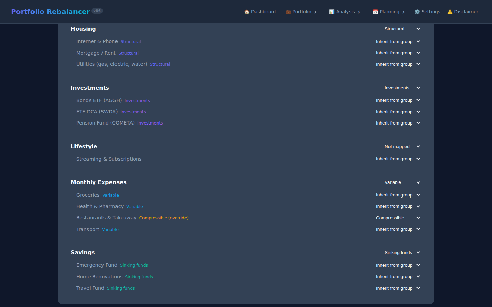

### Transactions

The full history of buys, sells, dividends and coupons, with a quick-add form.

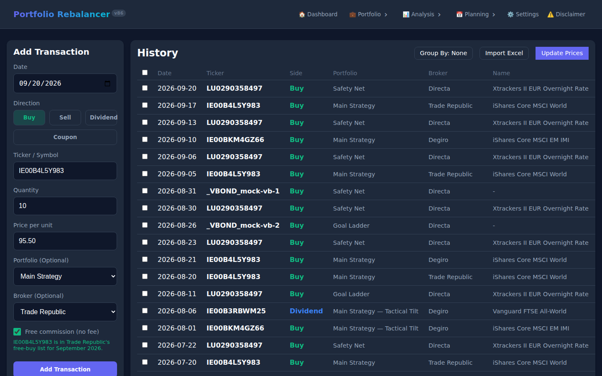

- **Add Transaction** (left) — ticker, direction (Buy / Sell / Dividend / Coupon), quantity, price, date, portfolio, broker, and a *free commission* flag that ticks itself when the ISIN is on that broker's free-buy list for the month.
- **History** (right) — sortable table, **Group by Portfolio, Broker or Asset**; each group header shows running totals and **total fees** (toggleable between EUR and %).
- **Inline & modal editing** for quick fixes vs full entry.
- **Broker cash auto-sync** — saving a new Buy automatically decreases the broker's available cash and a Sell increases it (dividends/coupons are excluded), keeping broker liquidity aligned with the trade history.
- **"Missing Free flag?" warning** — a Buy executed in a month/broker covered by a free-buy promotion (see *Settings → Free Buy Promotions*) but saved without the *Free* flag gets a ⚠ badge with a one-click fix.
- **Update Prices** triggers the live multi-source price refresh (see below).

**Bulk Edit** — select multiple rows to change broker / portfolio / commission together; unchanged fields keep a "keep original" label so you know exactly what will change. The toolbar also offers a quick **Export Excel** for the selected rows.

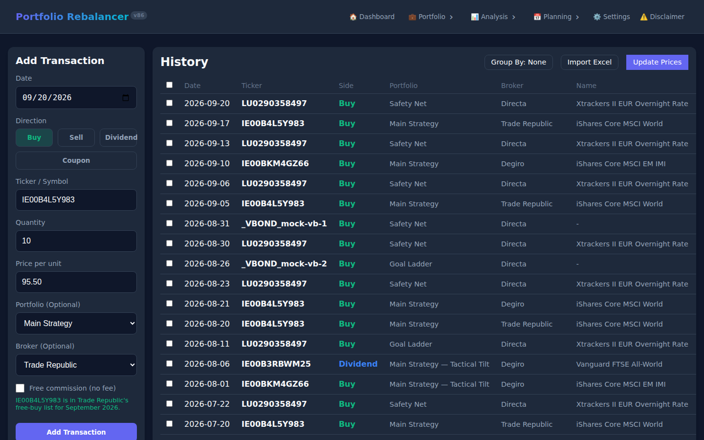

**Excel Import** — import an `.xlsx` history from your broker; the importer recognises a `Broker` column and maps it onto each transaction.

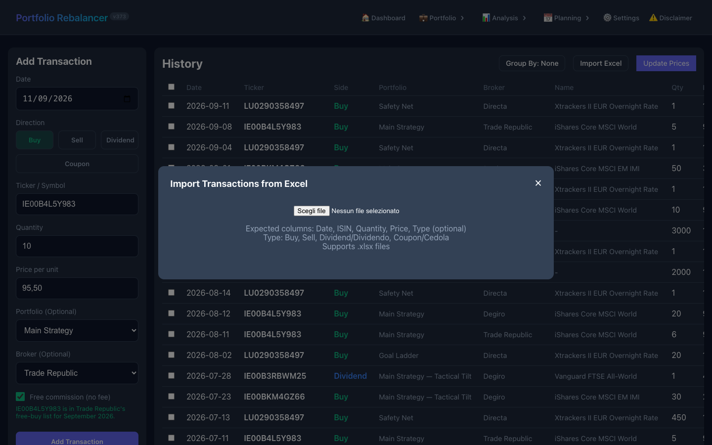

#### Grouping transactions

The **Group By** button cycles the history through `None → Portfolio → Broker → Asset`, splitting the transaction list into sections with a running summary in each header.

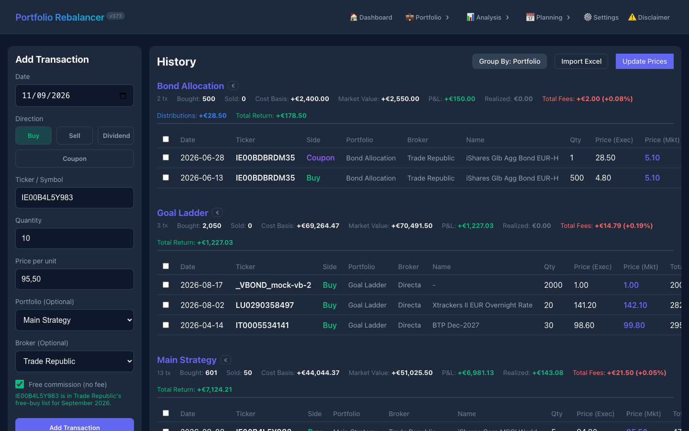

- **By Portfolio** — every transaction routed to that portfolio (including its sub-portfolios' tickers when shared).

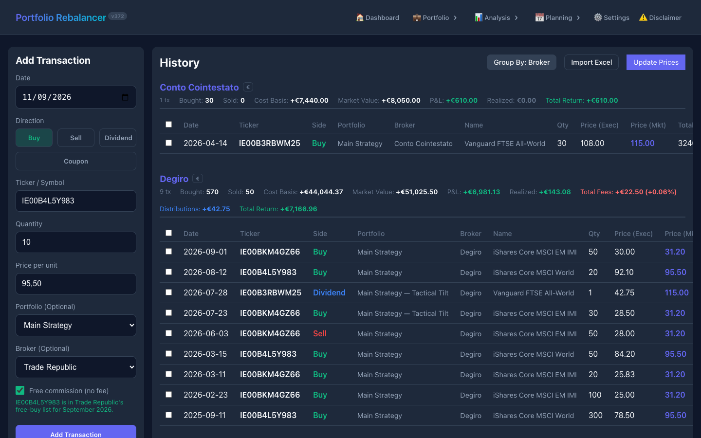

- **By Broker** — transactions executed at that broker, useful for checking per-broker activity and fees.

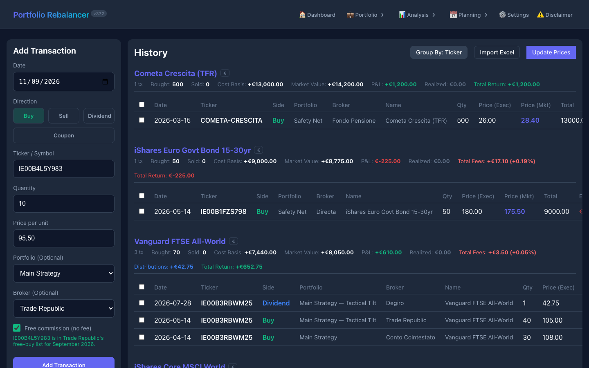

- **By Asset** — every Buy/Sell/Dividend/Coupon for a single ticker, grouped under its display name.

Each group header shows:

- **Number of transactions** in the group.
- **Bought** / **Sold** — total quantity bought and sold.
- **Cost Basis** — current book value of the held quantity (quantity × average purchase price).
- **Market Value** — current market value of the same holdings.
- **P&L** — unrealized gain/loss on the open position.
- **Realized** — gains/losses already locked in from past sells.
- **Total Fees** — sum of commissions paid (hidden if zero).
- **Distributions** — dividends/coupons received (hidden if zero).
- **Total Return** — P&L + Realized + Distributions, the overall result for the group.

A small **€ / %** toggle on each header switches P&L, Realized, Total Fees, Distributions and Total Return between absolute euro amounts and percentages of the cost basis.

### Portfolios

Organise investments into distinct portfolios (e.g. *Main Strategy*, *Bond Allocation*, *Safety Net*), including nested parent/child portfolios.

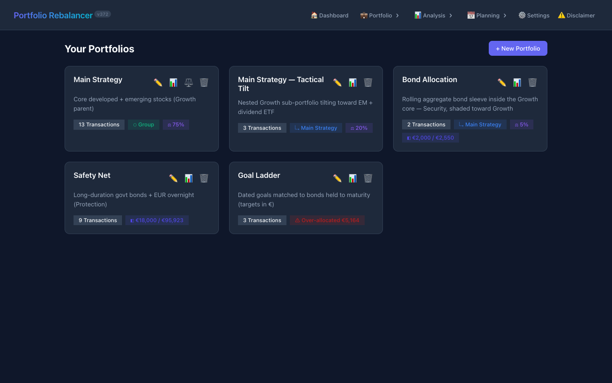

**Parent/child groups** — a portfolio nested under another is not just a visual grouping: the two are read as **one portfolio** wherever that is the useful reading (Stats pyramid, Performance, Fund Relocation, Asset Allocation).

A child is normally a **sleeve inside a core**, and it often carries a *different goal* than its parent — that is the point, not a mistake. The demo's *Bond Allocation* sits under the growth core on a **Security** goal: it holds a rolling aggregate bond ETF, which never matures, so it behaves like Security shaded toward Growth rather than either one cleanly. The group counts as one portfolio, so that value is counted at the parent's level in the pyramid and drawn there in a lighter tint of it (see *Stats*).

The **group ratio** — how the group splits internally between parent and children — is set here, from the ⚖ button on the parent's card:

- Give each member a **share %**. They are relative weights, so 80/20 and 8/2 mean the same thing; *Normalise to 100* rewrites them to read as percentages.
- Leave a member **blank** and it keeps its current share of the group — a portfolio added to a group is never planned down to zero before you have said what it should be.
- *Seed from current values* fills every share from what each member is worth today.

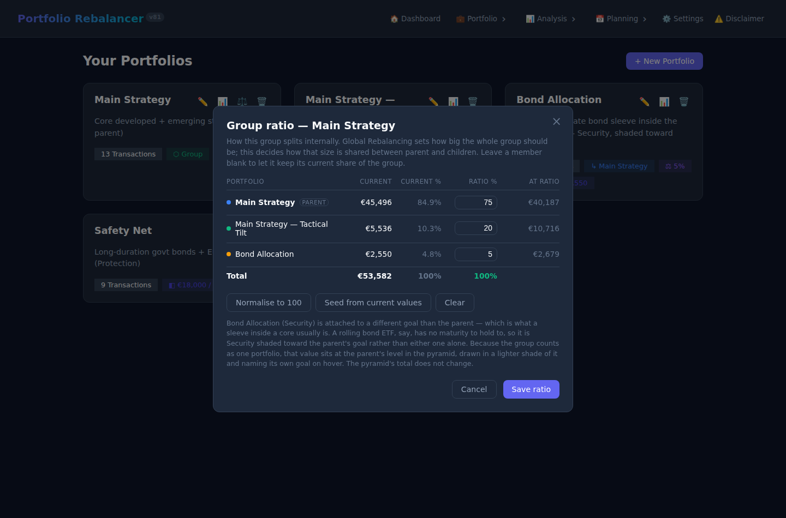

The ratio drives the Dashboard's ⚖ *Portfolio rebalance* panel, the Merged allocation table, and how Asset Allocation splits the group's target across its members.

Each portfolio has its own **target allocation**, edited from the *Manage allocations* dialog. Targets must total 100%.

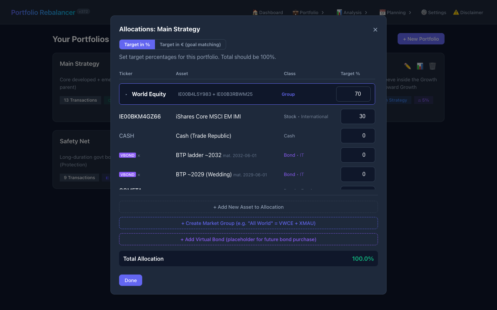

**Allocation (Market) Groups** — several interchangeable tickers can share a **single target %**. In the demo, *World Equity* holds one target of 70% over SWDA + VWRL:

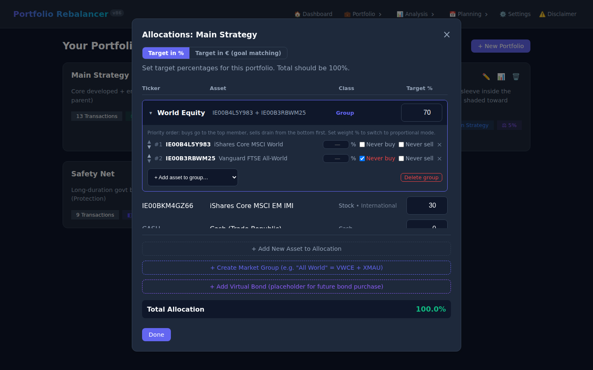

- **Member priority** — the order decides which member is bought first / sold last.
- **Per-member rules** — flag a member *Never buy* (held but never topped up) or *Never sell* (never trimmed, e.g. to avoid realising a gain). The rebalancer respects these when splitting the group's target across its members.
- **Weighted mode** — alternatively, give the active members an **intra-group weight %** (must sum to 100): buys and sells then keep the members close to their weights instead of following priority order. The demo's *EM + Dividend Tilt* group splits its 100% target 60/40:

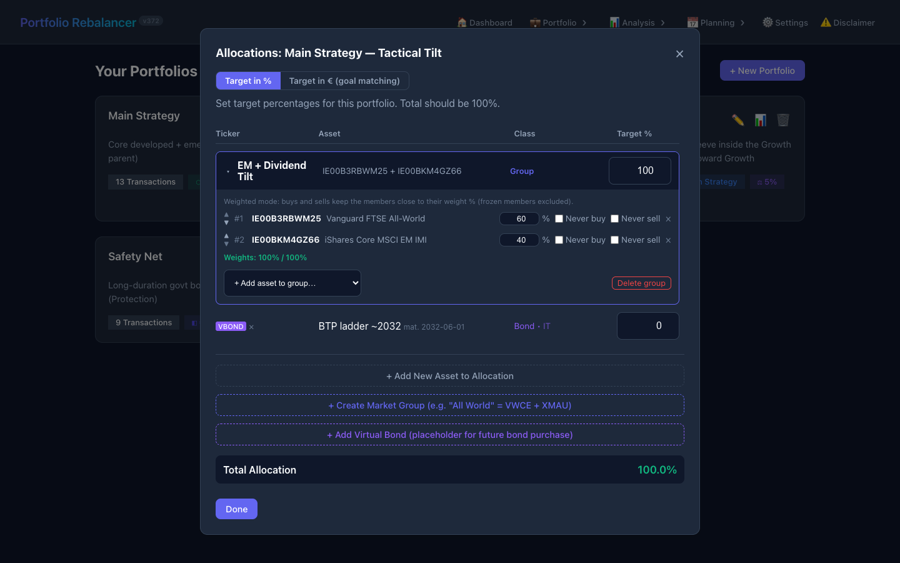

**Virtual Bonds** — a placeholder for a bond you *plan* to buy (e.g. the next rung of a BTP ladder) before choosing the actual ISIN:

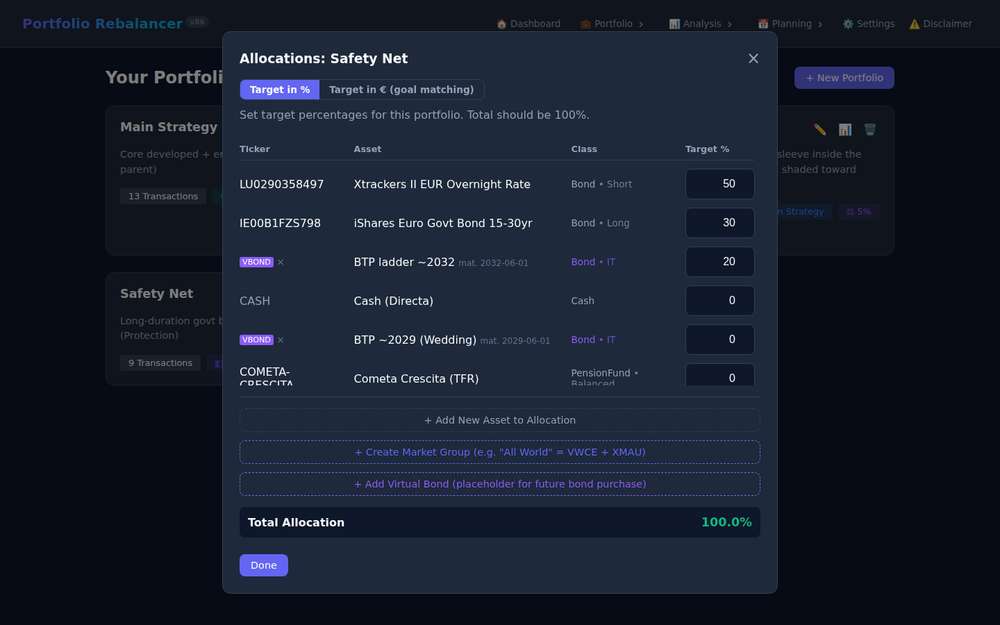

- A virtual bond has a **label, target maturity date and universe** (Italy-only or EU) and takes a normal **target %** in the portfolio's allocation.
- **Parking** — cash earmarked for it is parked on the placeholder (valued 1:1) so the rebalancer stops trying to deploy it elsewhere; the demo's *Safety Net* has €3,000 parked on its 2032 rung.
- **Bond proposals** — when the maturity window opens, the app suggests real bonds (from public bond lists) matching the target maturity, and **concretising** the placeholder swaps it for the chosen ISIN, migrating target % and parked cash into a real Buy.

**Concretising** happens from the *Concretizza* button on the placeholder's Dashboard row: the modal lists real bonds whose maturity falls inside the configured window (sorted by yield), picking one pre-fills ISIN and label, and you complete the fill with quantity, price, broker and portfolio:

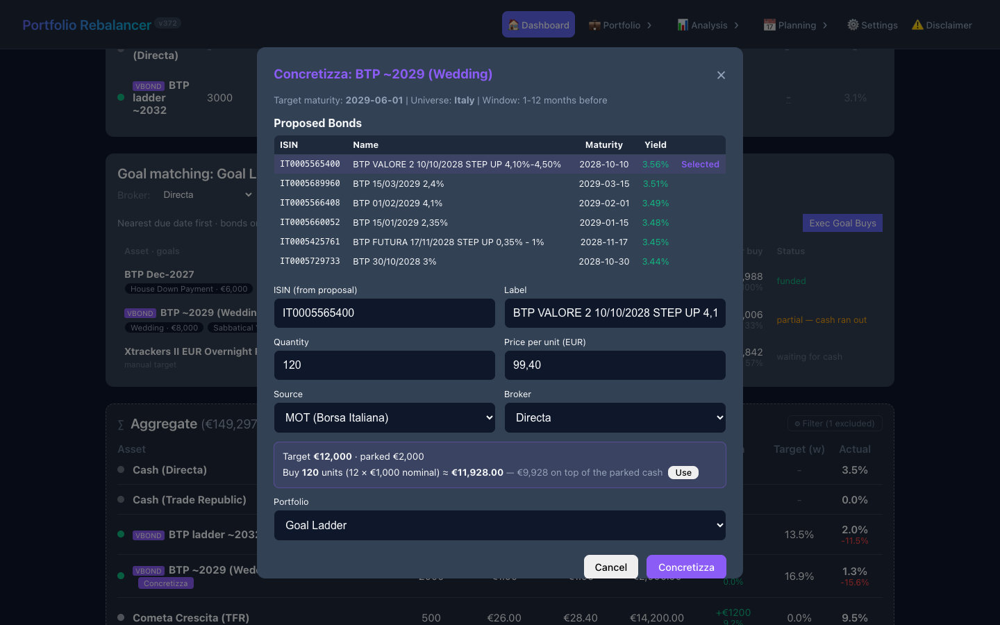

The *New Virtual Bond* form, from the allocations dialog:

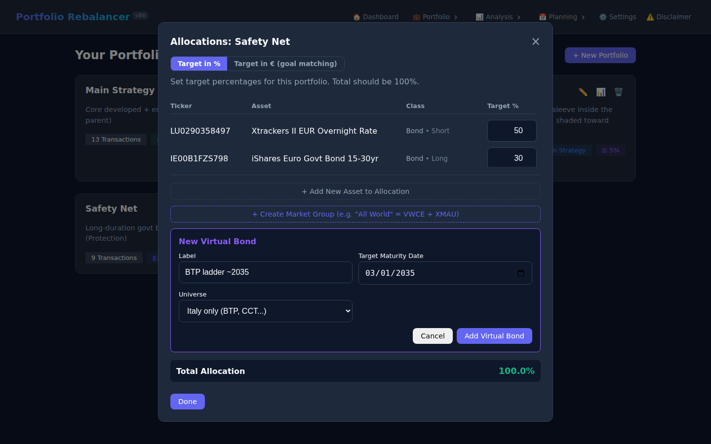

### Asset Allocation (Global Rebalancing)

A top-down split of **total wealth** across portfolios — the complement to the per-portfolio drift on the Dashboard.

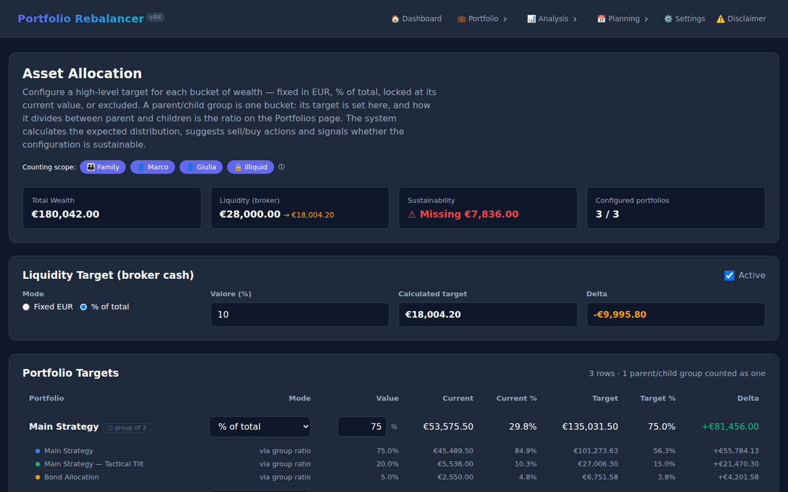
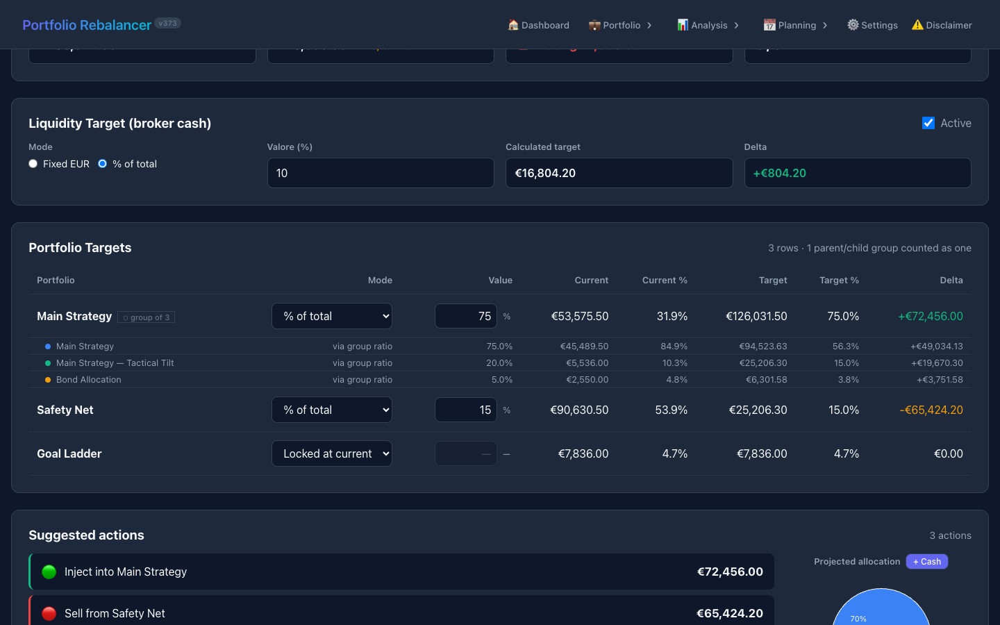
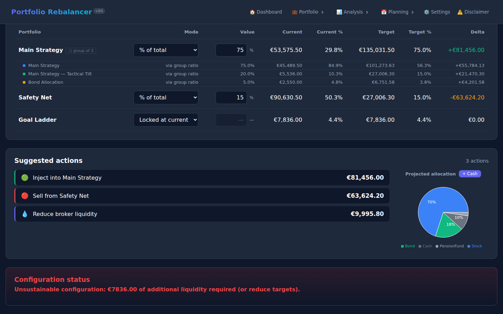

A **parent/child group counts as one row**: this page decides how big a bucket of wealth should be, and a group is one bucket. Its members appear underneath in read-only sub-rows, with the € each would get derived from the group ratio set on the Portfolios page — so the split is visible here but only editable there.

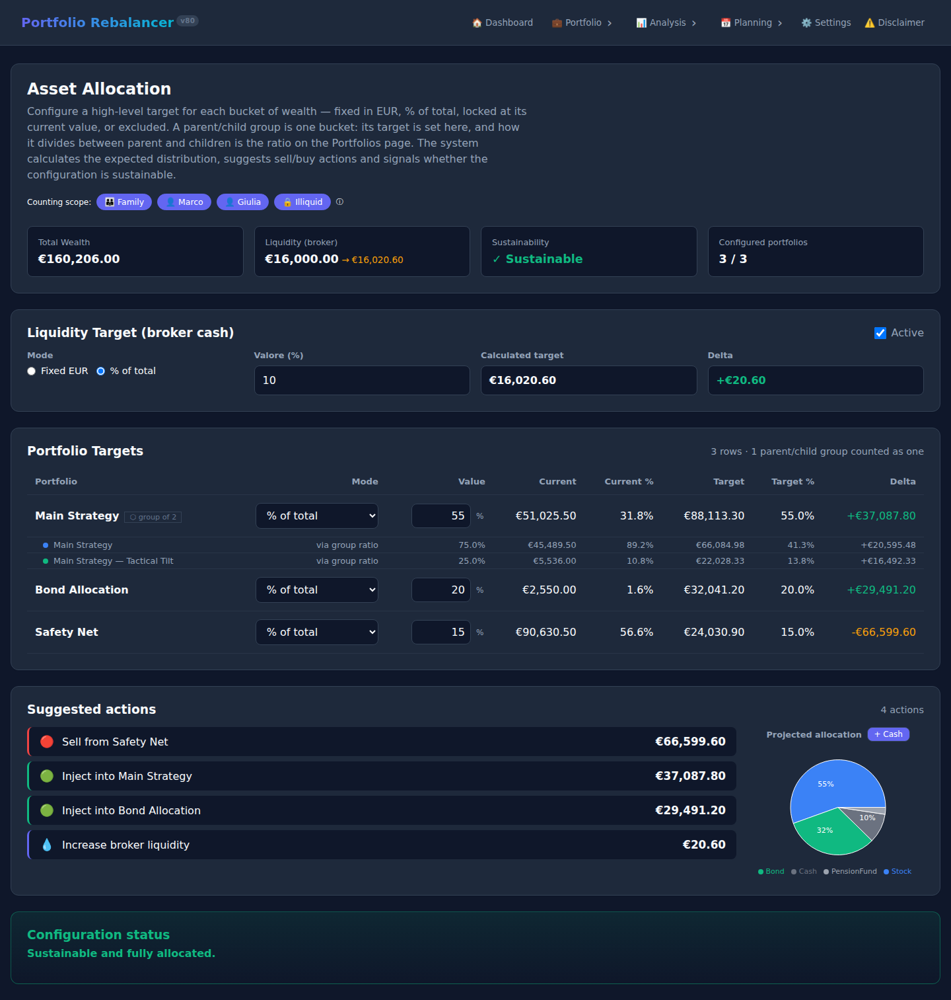

Each portfolio's (or group's) target can be:

- **Fixed EUR** — an absolute amount.
- **% of total** — a percentage of the eligible wealth.
- **Locked** — counts toward the total but never moves.
- **Excluded** — ignored entirely.

There is no ratio setting here. Sharing one budget between portfolios is what a
parent/child group is for, and its split is the ratio on the Portfolios page —
so a proportion is stated in exactly one place.

There is a dedicated **Liquidity Target** (broker cash) row, a **sustainability indicator**, and per-portfolio delta vs current value with suggested buy/sell actions.

> **Upgrading from an earlier version.** Two things move on first load, once:
>
> - the parent/child ratio used to be implied here, by whatever the members' individual targets normalised to. It is read and rewritten as a group ratio on the portfolios, with the members' rows folded into a single group target — the ratio you had is the ratio you keep;
> - **Ratio Groups** are gone. A group with a stated budget is converted faithfully: a *Fixed EUR* group hands each member its share in euro, a *% of total* group hands each member its share of the percentage. A **Remainder** group stated no number of its own, so its members become **Locked** at their current value rather than being given an invented target — set one for them when you next open this page.

### Goals

Define ordered goals — Growth, Protection, Security, Liquidity… — and attach portfolios to them. Goals drive the pyramid visualisations on the Stats and Dashboard pages.

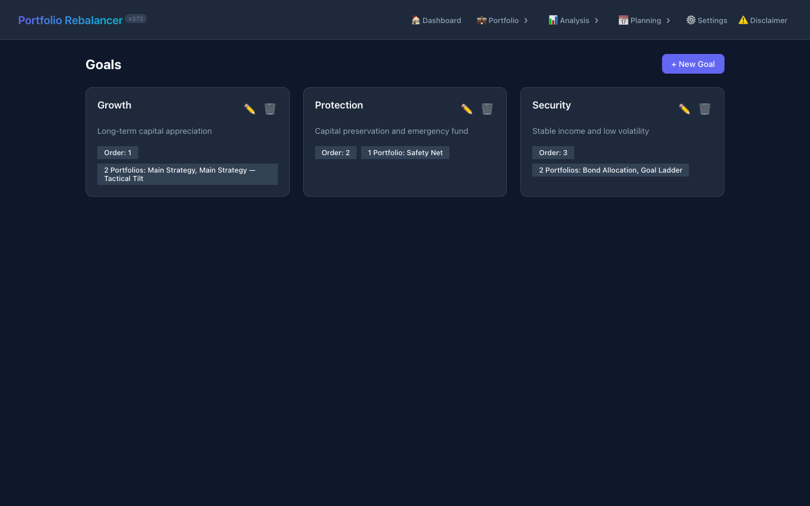
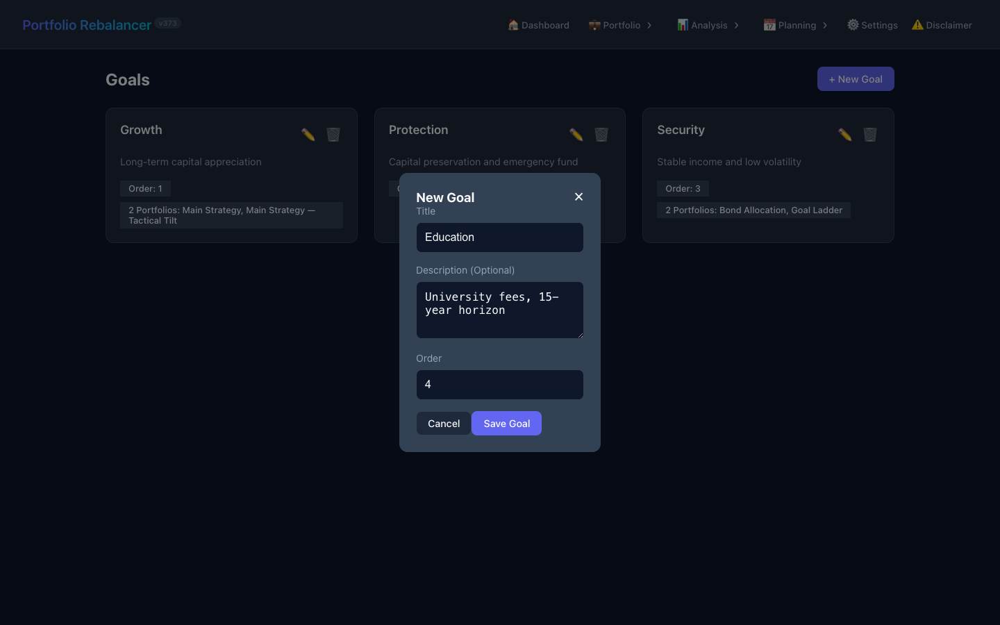

### Brokers

Manage brokers, their commission model and their cash positions.

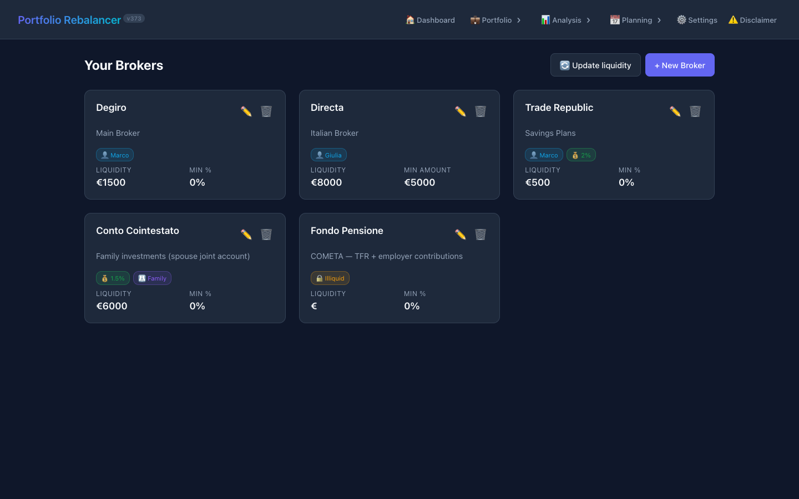

- **Commission models** — fixed, or percentage with min/max.
- **Liquidity tracking** — available cash per broker, with an optional **minimum threshold** the forecast and rebalancer respect. New Buy/Sell transactions adjust the broker's cash automatically.
- **Liquidity allocations** — earmark part of a broker's cash to specific portfolios.
- **Cash remuneration** — a broker that pays interest on the cash parked there gets a gross **annual rate**, a **credit frequency** (daily, monthly, quarterly, every 6 months, yearly), the **day of the month** the interest lands on and the date it starts accruing from. Optionally only part of the liquidity is remunerated: *up to an amount* (the usual "remunerated up to €100,000" offer) or *a share of it*. A **withholding tax** (26% on Italian deposit interest, and what a new plan starts from) is taken off at source: only the net is credited, and only the net compounds — set it to 0 to be paid gross. Interest is ACT/365 on the remunerated slice, and the plan remembers what has already been credited so a period is never paid twice.
- **Update liquidity** — one button, two sources, kept apart so it is plain which figure comes from where. **Balances from YNAB** lists the brokers mapped to an account in Settings, with *current → YNAB balance → delta*; brokers mapped to different budgets are all refreshed in the same pass, and the preview names the budget each row came from. **Interest to credit** lists the remunerated brokers, with the period covered, how many credit dates it spans, and gross → tax → net. Each section has its own select-all and every row its own checkbox, so you can take both, either one, or single rows — what you leave unchecked is not touched. A broker that is both mapped *and* remunerated appears in both sections: picking both adds the interest on top of the bank balance that normally already contains it, so that combination is flagged as a double count. Interest left unchecked stays pending and comes back at the next update — only what is actually credited moves the plan's watermark.
- **Asset scope** — each broker is either **Personal** (optionally attributed to a person from the Settings *People* list) or **Family**, and can additionally be flagged **Illiquid** (e.g. a pension fund). The counting-scope chips on Dashboard, Stats, Forecast and Performance then filter the totals: *person A + family*, *only person A*, family excluded, and so on. Personal brokers with no person assigned are always counted.

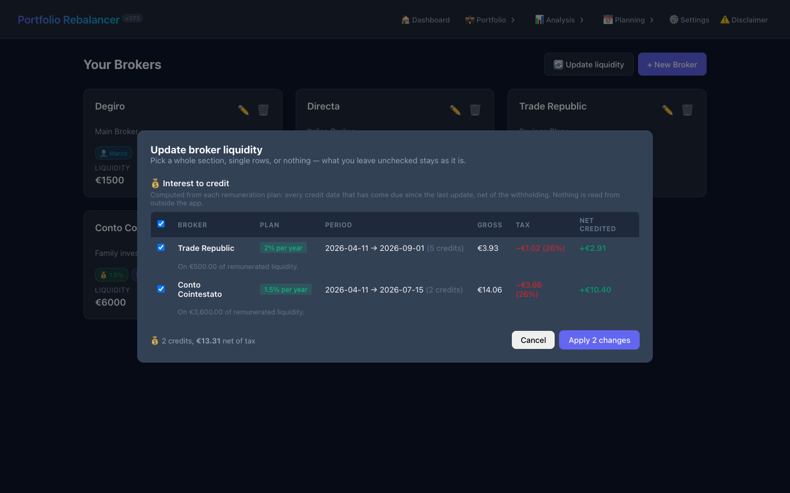

Editing a broker lets you configure its **ownership** (personal/person or family), its **commission rules** (fixed fee, or percentage with optional min/max), the **minimum liquidity** to keep on hand — either as a percentage of the broker's value or a fixed amount, optionally split across portfolios — and its **cash remuneration**:

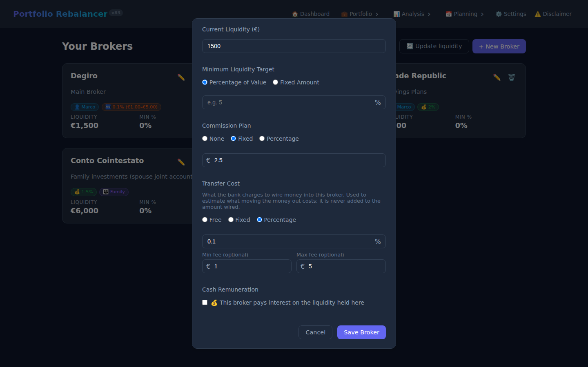

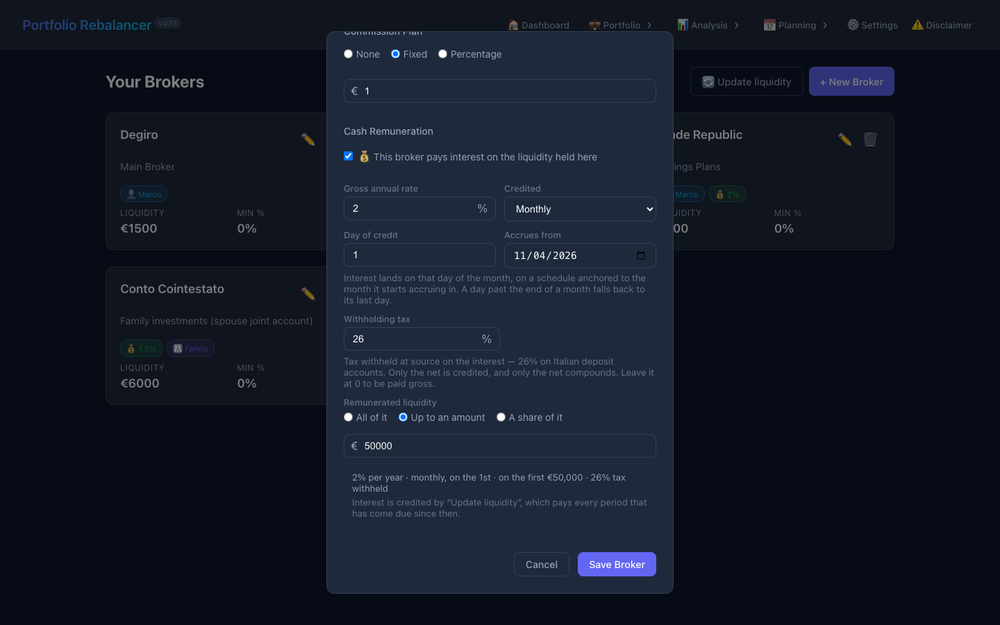

### Forecast

Project net worth and liquidity over a configurable horizon.

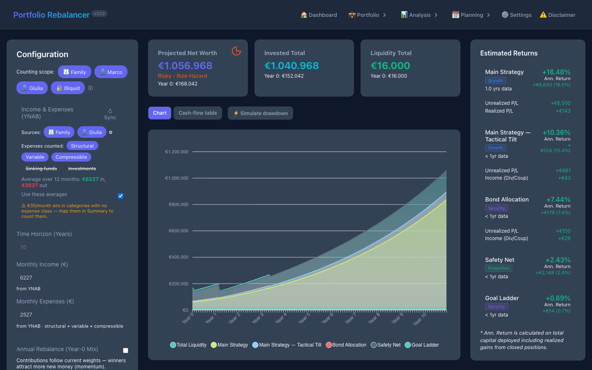

- **Inputs** — time horizon, monthly income/expenses, an annual-rebalance toggle, and **planned annual expenses** with their source goals and an *allow erosion of liquidity* control. The funding sources stay editable after the expense is in the plan: click the goal list on any planned expense — manual or imported from YNAB — to re-pick which goals (and so which portfolios) it draws from. Edits to an imported expense survive until the next *Sync from YNAB Goals*, which rebuilds the list.
- **Per-portfolio expected return** (annualised), derived from each portfolio's realised performance.
- **Verdict** updates live: **Sustainable**, **Risky** (expenses covered but a liquidity threshold is breached) or **Failed** (insolvency before the horizon ends).

**Monte Carlo (Volatility)** turns the single deterministic line into a distribution: it samples monthly returns from each portfolio's volatility (lognormal, uncorrelated) over hundreds of simulations, draws **10–90 and 25–75 percentile bands** plus the median, and reports a **probability of success**. Volatility is estimated from each portfolio's asset mix and downloaded/realised data, and can be overridden per portfolio.

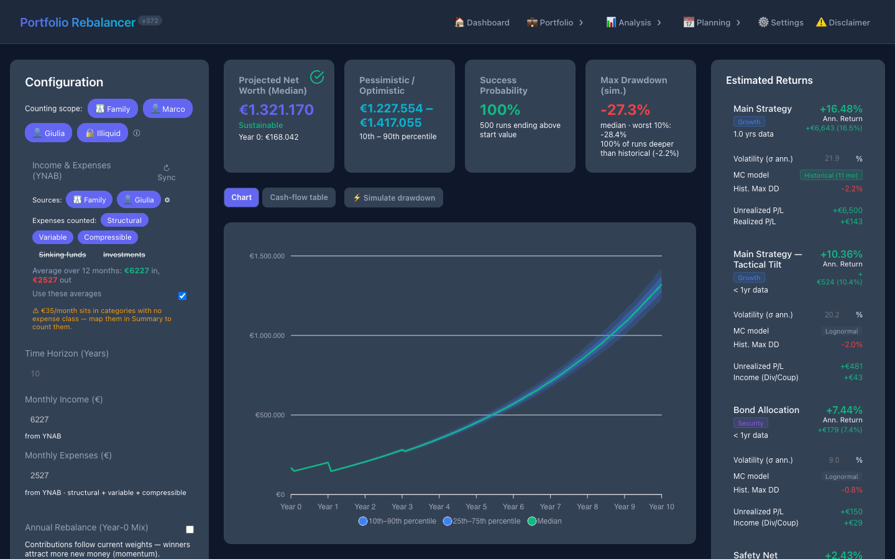

**Cash-flow table** — a toggle next to the chart swaps the projection for a table that follows the money instead of drawing it. It opens on **Year 0** — today, before the first simulated month, with no flows of its own — so the first projected year is read against a figure in the table itself and the rows are numbered the way the chart is. Then, per year (or per month), it shows the **income flow**, the **planned expenses** that erode liquidity, the **market P/L**, the deepest **dip** below the high-water mark and the resulting **net worth**, with a totals row over the whole horizon. Each row reconciles exactly — opening + income − expenses + market = closing — and the dip is measured flow-adjusted, so spending 30k is never mistaken for a 30k crash. With Monte Carlo on, the table walks one **real simulated path** (pessimistic / median / optimistic, picked by final net worth) rather than the percentile envelope: the ups and downs in the rows are the random returns and drawdowns that path actually went through.

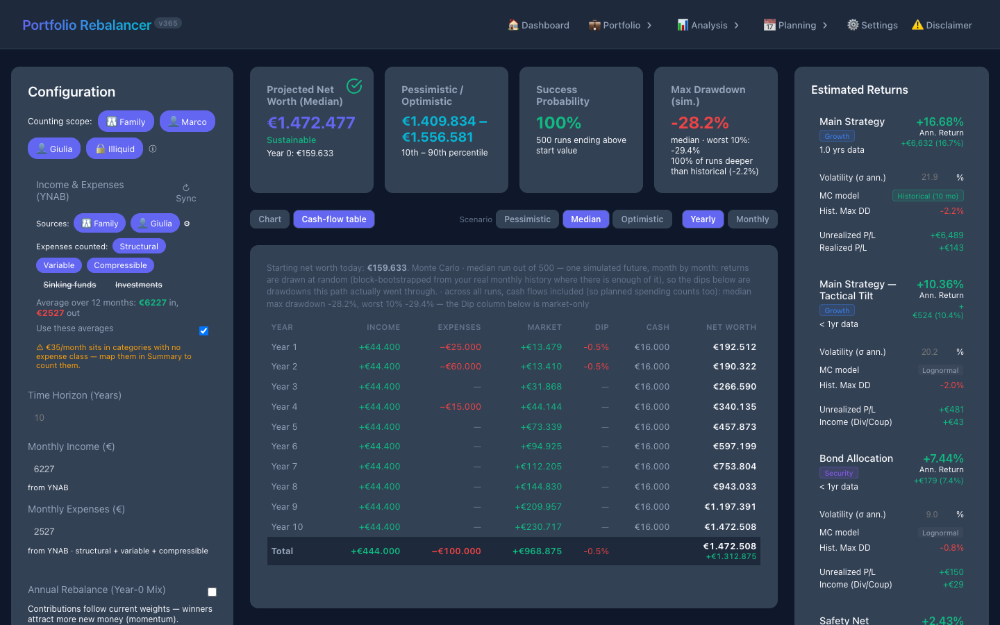

**⚡ Simulate drawdown** — the deterministic projection only ever grows, so the *Market* column never takes money away and a plan is never read against a bad decade. This button drops a **named crash** into it, and the severity belongs to the **asset class**, not to the portfolio: equity falls 20 / 35 / 50 / 80% depending on the scenario, bonds move by **duration and by which way rates went** (a flight to quality lifts the long end, a *rate & inflation shock* takes 30% off it), the money market barely registers — a couple of tenths of a percent, and only in a systemic freeze — while gold and crypto go wherever the scenario sends them. Each portfolio then falls by **its own mix**: 40% equity and 60% short bonds cannot lose 50%, and the simulation will not pretend it can.

It is a path, not a step. The fall is spread over months, the classes share the *timing* of the event but not its depth or its shape, and a Brownian bridge pinned to the trough gives bear-market rallies and green months inside a red year — while the trough and the exit level still land exactly where the scenario says. The crash is applied **on top of the drift**, so a money-market bucket keeps earning through it and the years outside the window are euro-for-euro identical to the undisturbed plan. The panel states the assumptions before the chart moves (what each class you hold does, what that blends to for your capital) and the consequences after (where net worth bottoms, measured **against the same plan with no crash** so a house deposit due that year is not charged to the crash, and how much compounding is never made back). Monte Carlo pauses while a crash is scripted: one is a random ensemble, the other a single written future.

Risky and failed plans:

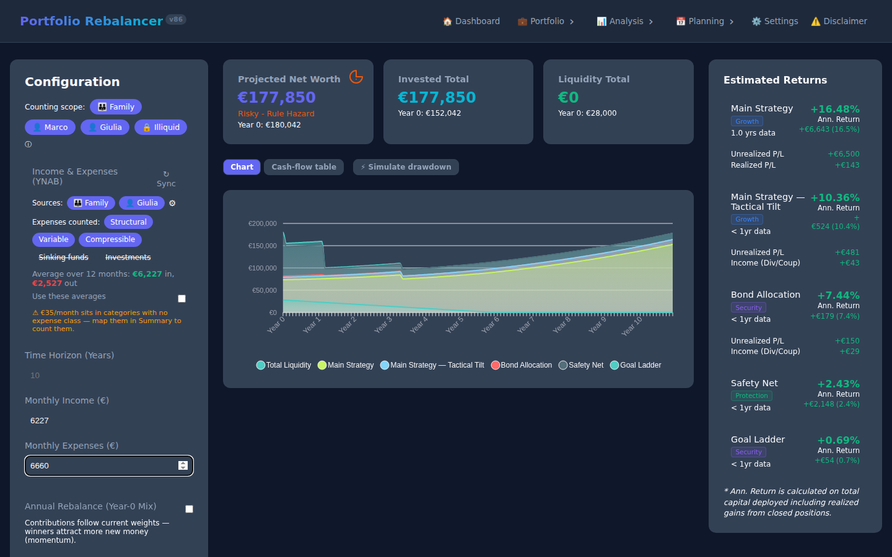
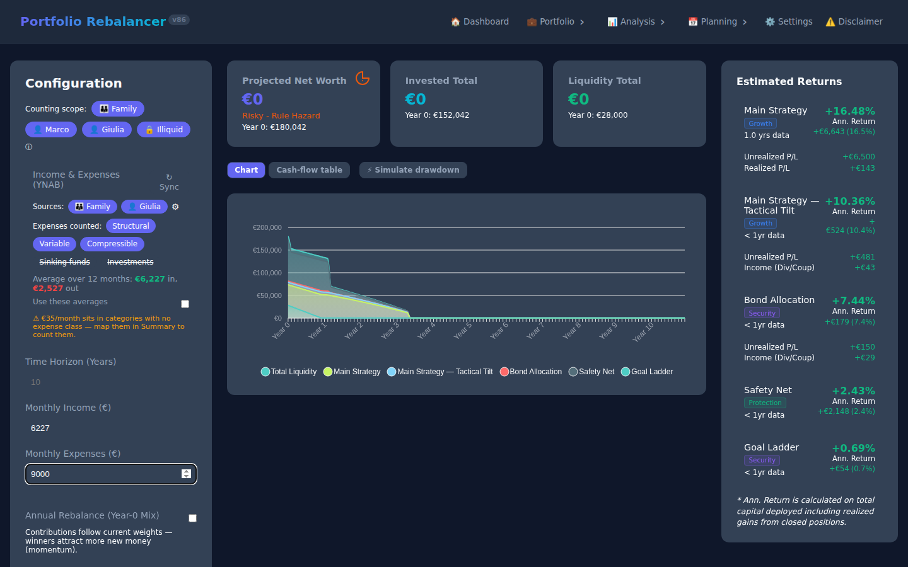

### PAC

Auto-track a recurring investment plan (*piano di accumulo*) — since the app has no background jobs, installments are only ever computed on the fly and only ever recorded when you confirm them.

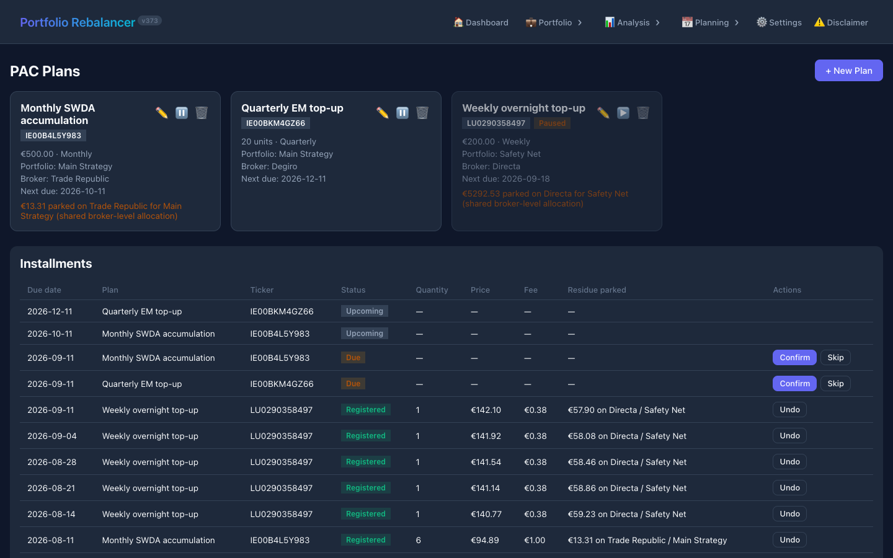

- **Plans** — a plan buys either a **fixed EUR amount** or a **fixed quantity of units** of an asset, on a **broker + portfolio** pair, on a recurring schedule (weekly through yearly), with its own **fee model** (broker's commission plan, a fixed override, a percent override, or none) and, for the EUR-amount mode, a **rounding rule**: fractional units, whole units with the remainder parked, or whole units with the remainder parked *and* reused as extra budget for the next installment. Plans can be **paused**: they keep their history but stop suggesting new installments.

The plan form picks the asset from a dropdown that shows its **descriptive label** (the ISIN is what gets stored), and previews the resulting quantity, fee, outlay and parked residue at the latest known price while you type:

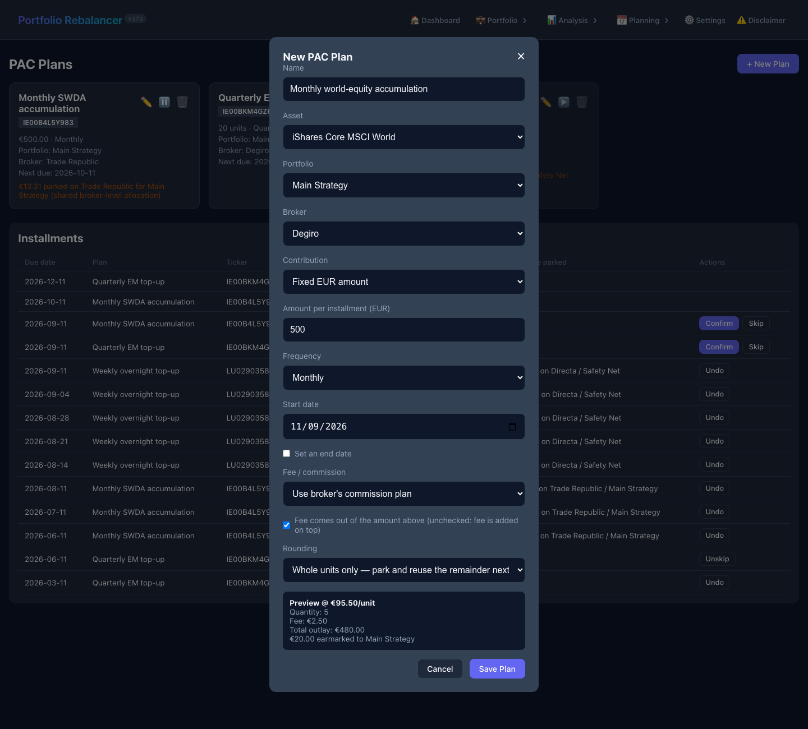

- **Installments** — every plan's due installments (based on today's date), the upcoming one and the already-registered ones, in one schedule with its quantity, price, fee and parked residue.

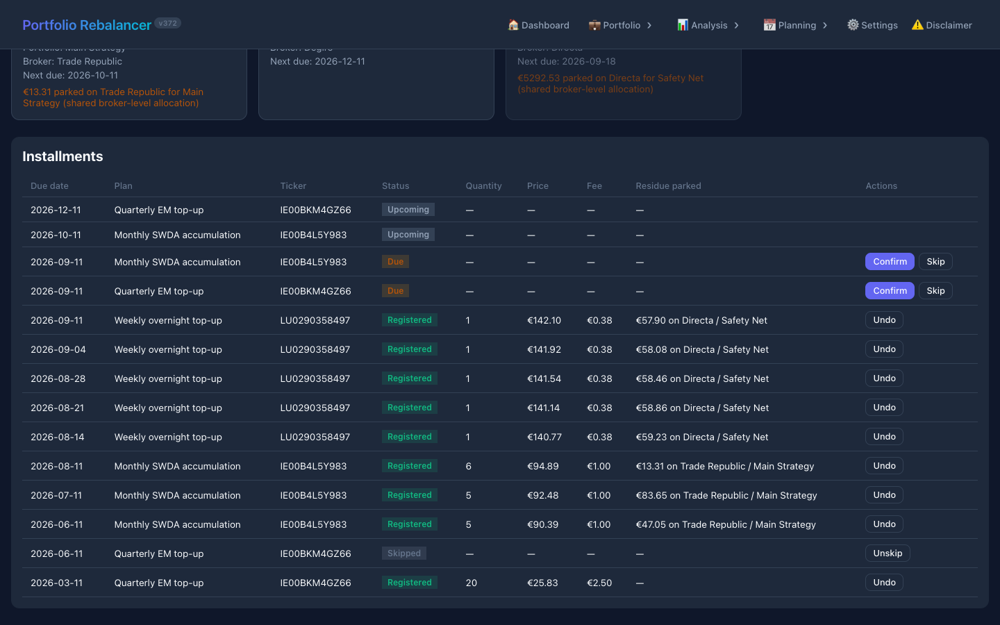

- **Confirm** looks up the unit price at the installment's date from the local price history (with an on-demand backfill button, or a manual override, when it's missing), then records a matching Buy in Transactions. **Skip** marks an installment as intentionally not taken, **Undo** removes the transaction and reverses the parked residue.

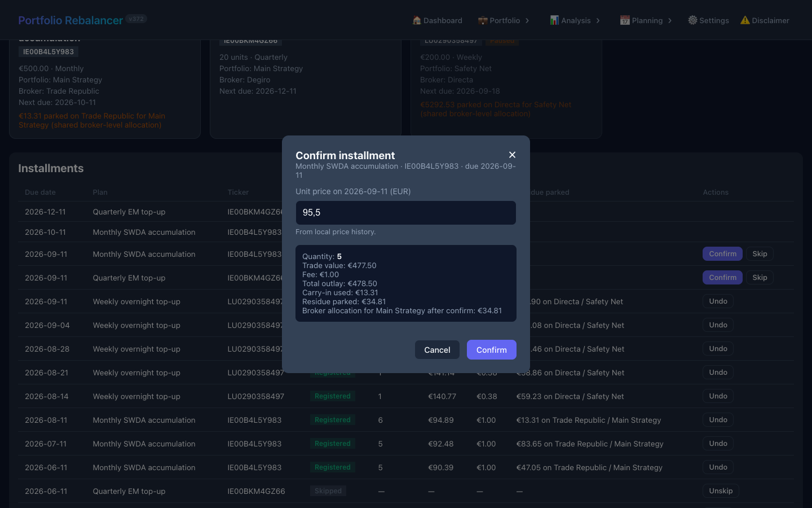

- **Liquidity parking** — any leftover cash from whole-unit rounding is parked into the broker's existing **liquidity allocation** for that portfolio (the same mechanism used on the Brokers page), not left as an abstract number on the plan. With the *reuse* rounding rule it comes back as extra budget on the next installment (the *Carry-in used* line above).

### YNAB

Pull your [YNAB](https://www.youneedabudget.com/) budget category balances and map each one to an investment asset or to broker cash.

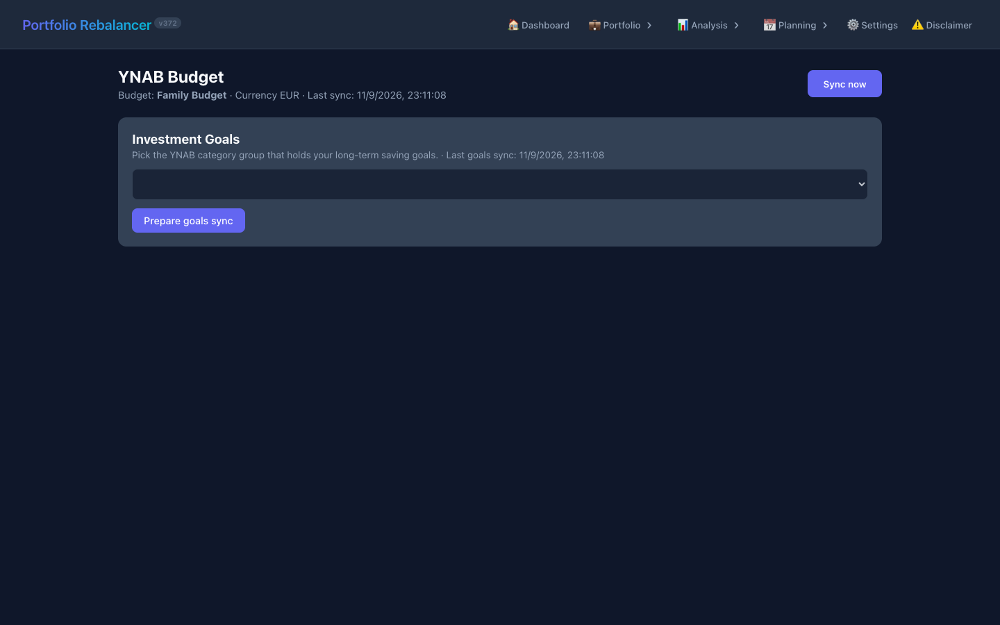

- **Current** vs **average N-month budgeted** columns (configurable window).
- Per-category mapping to an asset or broker cash; search / filter; summary by mapped asset; *Sync now*.
- Credentials and mappings stay on the device.

### YNAB Goals

Sync a chosen "Investment Goals" YNAB category group and fund each goal from one or more portfolios.

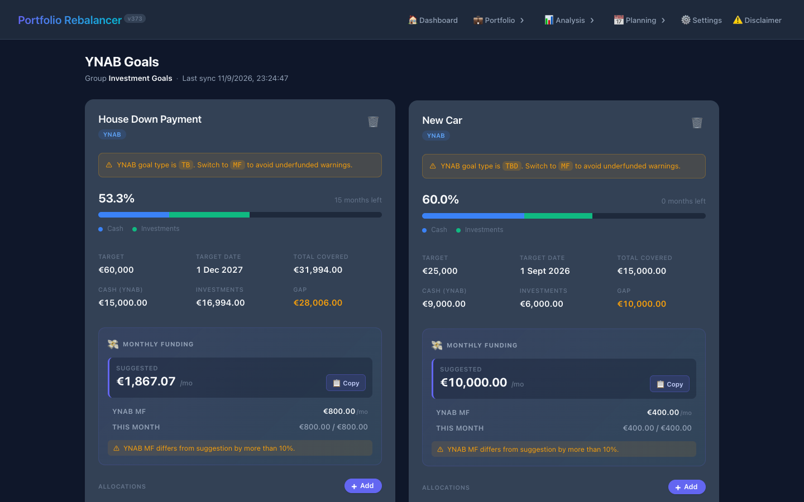

- Each goal card shows the YNAB **target**, **target date**, **cash coverage** and **total covered** (cash + earmarked investments).
- **Allocations** link portfolios to a goal with an amount; **suggested monthly funding** is compared against YNAB's own monthly funding, with warnings when they drift apart.

### Settings

The control room for data, sync, price refresh and integrations.

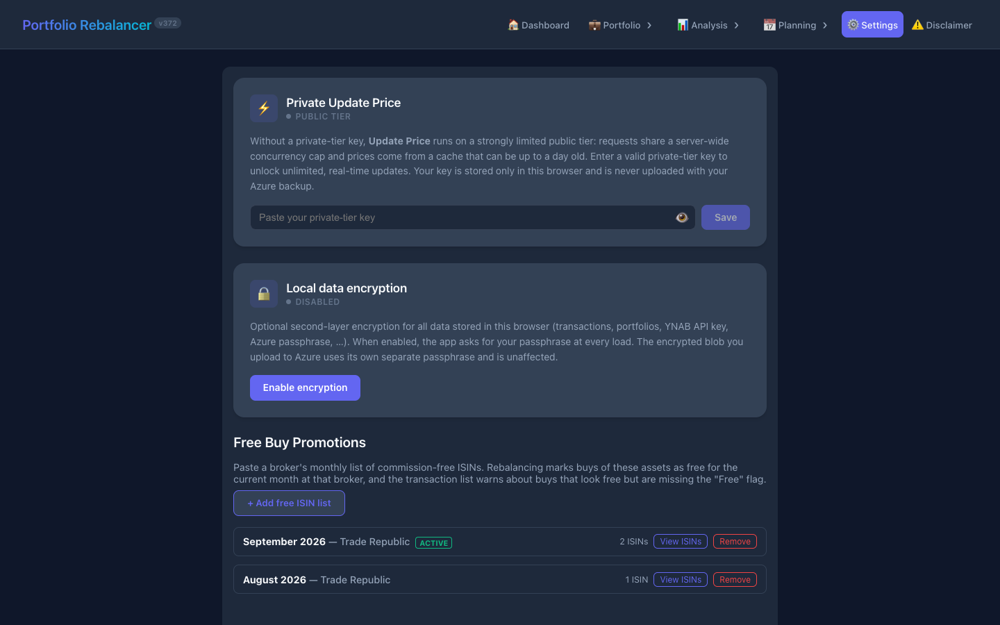

- **Private Update Price** — paste a private-tier key to unlock unlimited real-time price updates; without it, *Update Price* uses the throttled, cached public tier. The key is not something you buy: it is configured by whoever runs the instance (server env var `PREMIUM_KEYS`, kept under its original name for deployment compatibility) to reserve the scraper for their own use. It is stored only in this browser and is never uploaded with the Azure backup.
- **Local data encryption** — optional second-layer AES encryption for everything stored in this browser (transactions, portfolios, YNAB key, Azure passphrase…). When enabled, the app asks for your passphrase on every load. **If you forget it and have no Azure backup, the data is unrecoverable.**

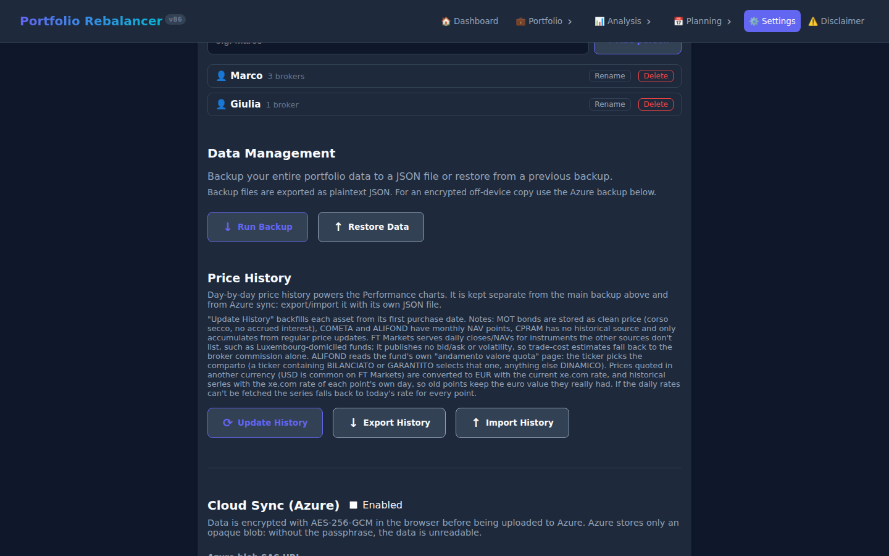

- **Data Management** — JSON backup / restore of all local data (plaintext).
- **Price History** — a *separate* backup for the daily price-history series; **Update History** backfills each asset from its first purchase date.
- **Cloud Sync (Azure)** — optional encrypted Blob sync: data is encrypted with AES-256-GCM in the browser before upload, so Azure only ever stores an opaque blob.

**Free Buy Promotions** — paste a broker's monthly list of commission-free ISINs (free text, ISINs are auto-detected) and pick the month and the broker running the promo:

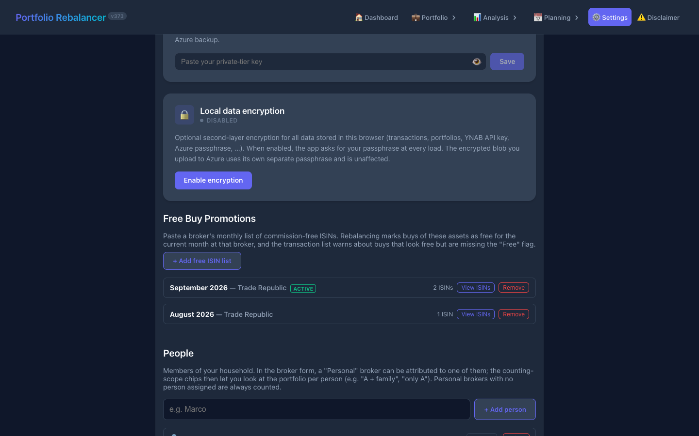
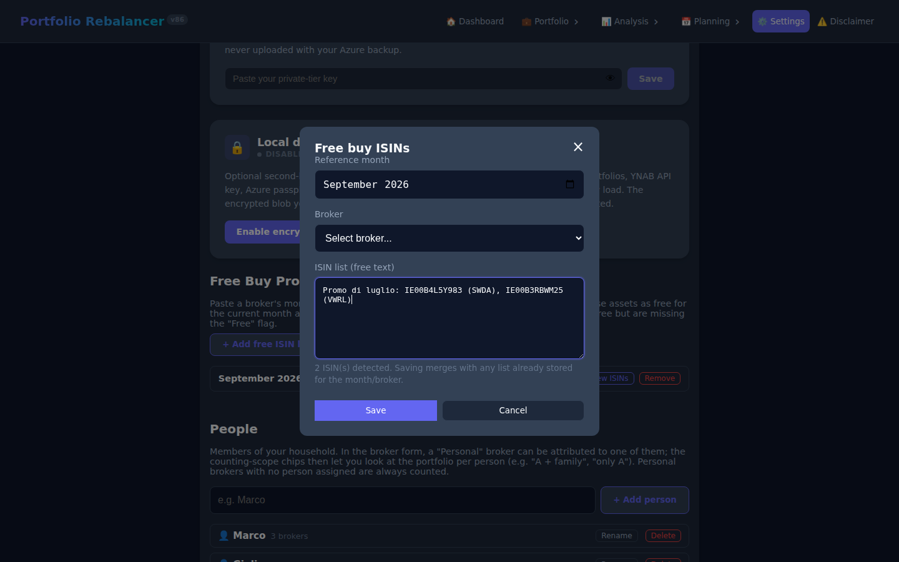

The saved lists are **broker-aware**: they pre-arm the free-buy toggle in the Dashboard's trade-cost popover and drive the *"Missing Free flag?"* warning in the transaction list — both only for trades at that broker.

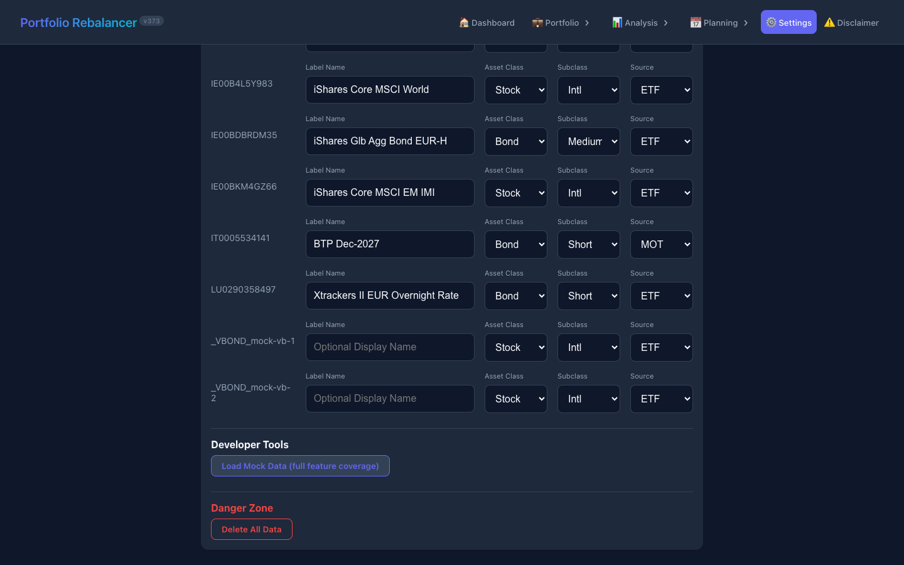

- **People** — the members of your household. A broker marked *Personal* can be attributed to one of them, which is what powers the per-person counting-scope chips. Deleting a person leaves their brokers personal but unattributed, so nothing disappears from the totals.
- **YNAB** — personal access token, budget selection, the "Investment Goals" category group and the **broker ↔ YNAB account** mapping used by *Update liquidity* on the Brokers page. Each broker picks its own **budget** and then an account inside it, so brokers can be split across several budgets of the same token; the budget saved at the top stays the primary one, the one category import, YNAB Goals and spending analysis read from. The relation is one-to-one *within a budget*: assigning an account that already backs another broker moves it, while the same account id in a different budget is a different account.
- **Asset Registry & Settings** — asset classes/subclasses, custom labels, macro and goal targets.
- **Developer Tools** — *Load Mock Data* (full feature coverage) and the *Danger Zone* clear-all.

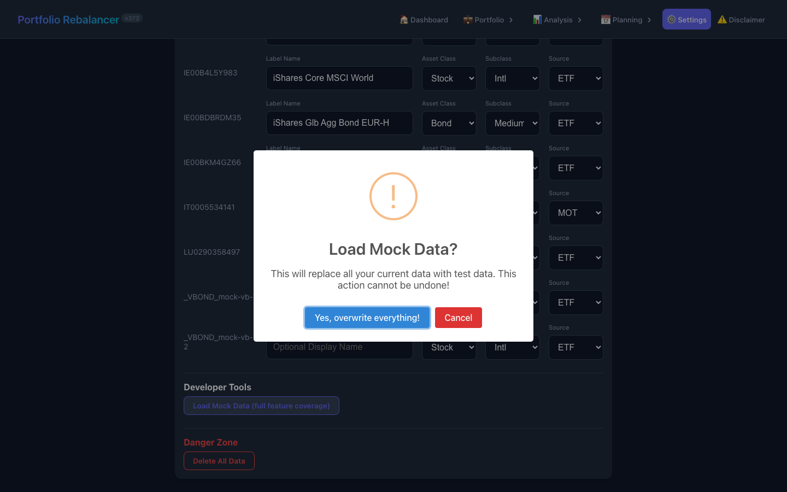

### Live Price Updates

Real-time feedback during the multi-source refresh, over WebSockets.

Without a private-tier key, the update starts with the **public-tier notice** (throttled, shared-cache prices):

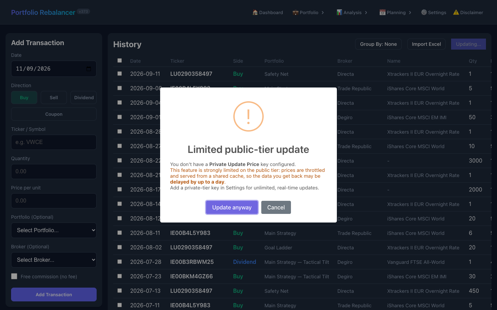

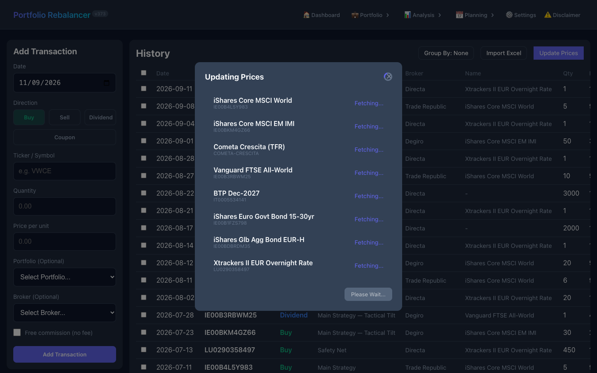

- Per-ISIN progress with success / error states; one failing asset never aborts the batch.
- Where the source exposes it, the result also shows **bid/ask spread %** and **volatility %**; public-tier results are flagged *cached · may be delayed*:

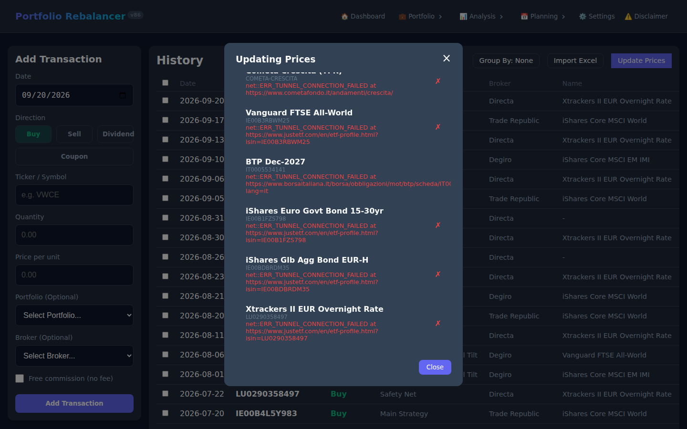

### Mobile

Every list view has a **dense expandable layout** on small screens — compact rows with the essentials (ticker, side, amount, fee, warnings), tap to expand. Wide tables are never left to horizontal scrolling, which would hide the column the page exists for: the *Fund Relocation* sell/buy tables become the same expandable rows, and its before/after tables become one line per item reading `before → after` with the change kept in view. The Dashboard's KPI cards pair up two per row instead of stacking ten deep, the before/after pies scale with the card, and no page scrolls sideways down to a 320px screen:

<p>
  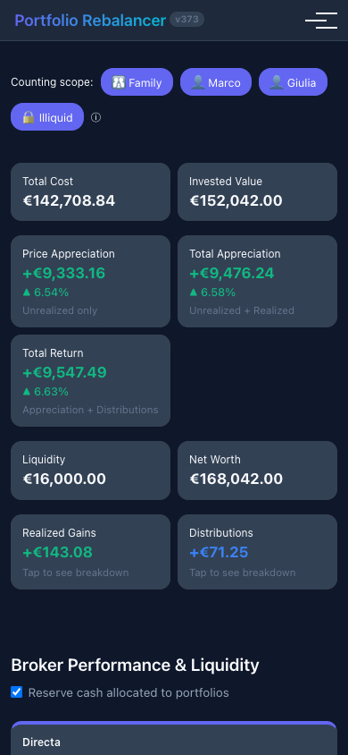
  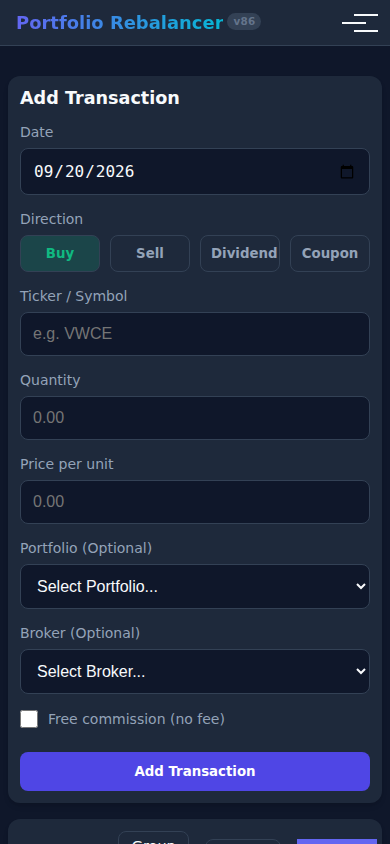
  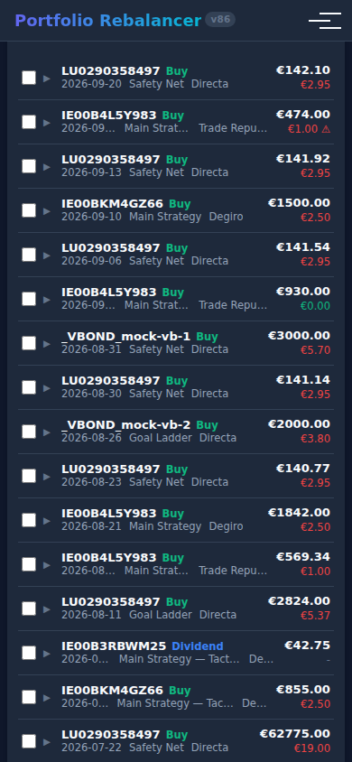
</p>

### Disclaimer

A dedicated page documenting local-only storage, data usage and the non-commercial nature of the tool.

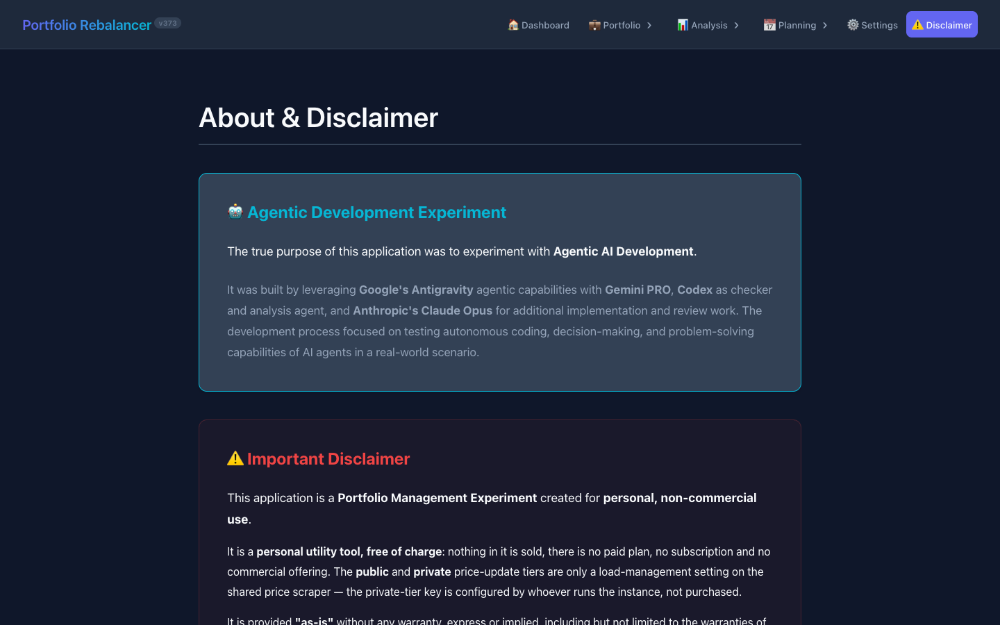

---

## Privacy Policy

This reflects how the app actually handles data today.

- **What is stored, and where.** All portfolio data — transactions (including broker details and fees), portfolios and allocation groups, targets, market data, daily price history, goals, broker liquidity, and YNAB configuration/mappings — is stored **only in your browser's `localStorage`** (keys such as `portfolio_transactions`, `portfolio_targets_v2`, `portfolio_market_data`, `portfolio_price_history`, `portfolio_goals`, `portfolio_ynab_*`). None of it is sent to our server or to third parties as part of normal use.

- **Optional local encryption.** You may enable second-layer AES encryption so that everything above is encrypted at rest in the browser, gated by a passphrase requested on every load. The passphrase is never transmitted; if lost, encrypted local data cannot be recovered without an Azure backup.

- **Optional cloud sync (Azure).** If you enable Azure Blob sync, the data is encrypted with **AES-256-GCM in the browser** using a passphrase you choose, and only the resulting **opaque ciphertext blob** is uploaded to your own Azure container via a SAS URL. The passphrase is never sent to Azure. **YNAB credentials and the private-tier price key are intentionally excluded from the Azure payload**; price history is backed up separately.

- **Data sent to price sources.** Price lookups send **only the ISIN and the chosen source** to the `/api/price` endpoint, which fetches the quote from the relevant public page (JustETF, Borsa Italiana/MOT, CPRAM, COMETA, ALIFOND, FT Markets). No personal identifiers, balances or portfolio data are transmitted. A non-EUR quote triggers one extra request to xe.com for the exchange rate, carrying only the currency pair. On the public tier, responses may be served from a short-lived server-side cache.

- **Data sent to YNAB.** YNAB calls go **directly from your browser to YNAB** using your personal access token. The token is stored locally and is never synced to Azure.

- **Cookies.** The app sets no cookies for its own functionality. Server-side scraping only dismisses third-party cookie banners (e.g. Borsa Italiana) while fetching prices; it does not create cookies for you.

- **Your device, your responsibility.** Because the data lives in your browser, its safety depends on your device and browser security (login, screen lock, user profiles, disk encryption). Enabling local encryption adds a layer, but device hygiene still matters.

- **Removing your data.** Use **Settings → Danger Zone → Clear all data**, or clear the browser's site data / `localStorage`. Private/incognito sessions discard everything on close.

---

## A note on how this was built

This project was developed with the help of agentic AI tools — **Antigravity**, **Codex** and **Claude Code** — used for implementation, refactoring, scraper development, testing, screenshotting and documentation.

**The product design, the feature decisions and the technical direction were entirely human.** The AI executed against goals, constraints and architectural choices defined by a person; it did not decide what to build or where the project should go.
